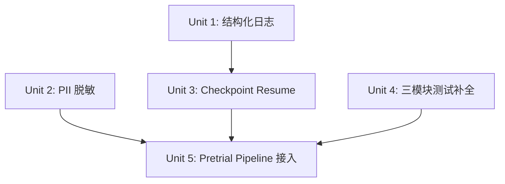
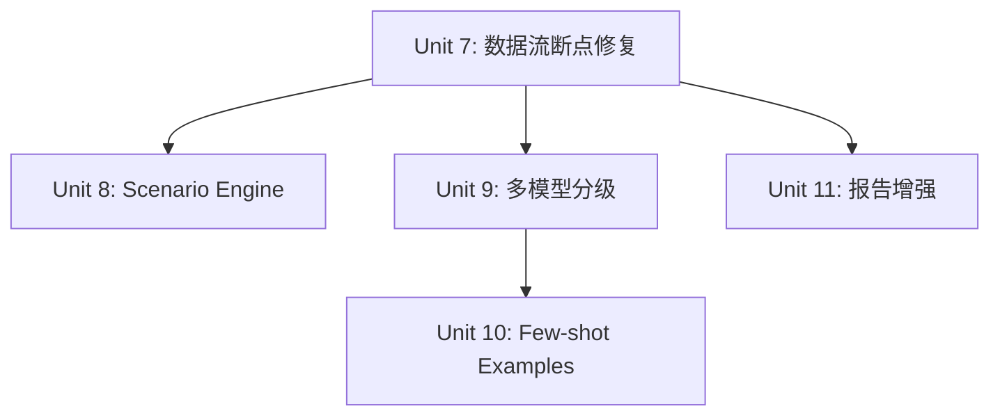

> Historical document.
> Archived during the April 2026 documentation reorganization.
> Kept for context only. Do not treat this file as the current source of truth.
---
title: "feat: v2 全面实施路线图 — 23 项工作的完整规划"
type: feat
status: active
date: 2026-03-30
---

# v2 全面实施路线图 — 23 项工作的完整规划

## Overview

在 v1.5.0 + v7 修订完成后，项目需要从"可运行的对抗分析引擎"升级为"生产可用的法律分析平台"。本计划覆盖 23 个工作项，分为 P0（必须做）、P1（应该做）、P2（可以做）三个优先级，组织为 6 个实施阶段。

## Problem Frame

当前系统已实现完整的三轮对抗 pipeline + 12 个分析模块，但存在以下关键缺口：
1. **pretrial_conference 引擎已实现但未接入主 pipeline**，evidence_state_machine 未在全链路强制执行
2. **interactive_followup 引擎可用但未达到生产标准**（缺少错误恢复、会话管理）
3. **三个核心模块零测试覆盖**（defense_chain, hearing_order, issue_dependency_graph）
4. **缺乏可观测性**（无结构化日志、无 token 追踪、无进度反馈）
5. **缺乏合规保障**（无 PII 脱敏、无法律免责声明）
6. **无中断恢复能力**（pipeline 失败需从头开始）

## Requirements Trace

- R1. pretrial_conference 接入主 pipeline，evidence_state_machine 全链路强制
- R2. interactive_followup 生产可用（错误恢复、多轮会话、输入验证）
- R3. defense_chain / hearing_order / issue_dependency_graph 100% 测试覆盖
- R4. 结构化日志 + LLM token 用量追踪
- R5. PII 脱敏 + 输出法律免责声明
- R6. 断点续跑 checkpoint resume
- R7. Scenario Engine what-if 分析可用
- R8. 模块间数据流断点修复
- R9. 多模型分级策略（haiku/sonnet/opus）
- R10. 关键 prompt 加 few-shot examples
- R11. 报告增强（风险热力图、调解区间）
- R12. 案件输入简化（文本自动提取 → YAML）
- R13. 配置文件外部化
- R14. CaseTypePlugin 接口
- R15. Web API 完善
- R16–R23. P2 级别工作项（CI benchmark、FastAPI 测试、法条白名单、streaming、DOCX 增强、进度反馈、评测回归、对象模型中立化）

## Scope Boundaries

- 不做 UI 前端（只做 API + CLI）
- 不做在线协作
- 不做刑事/行政案件的完整实现（只做插件接口）
- 不做多语言支持
- 不做实时推送（streaming 为 P2，非阻塞）

## Context & Research

### Relevant Code and Patterns

| 模块 | 路径 | 现状 |
|------|------|------|
| 主 pipeline | `scripts/run_case.py` | 5 步流程，未接入 pretrial_conference |
| pretrial_conference | `engines/pretrial_conference/` | 完整实现（conference_engine, cross_exam, judge_agent, minutes），有测试，未接入 pipeline |
| evidence_state_machine | `engines/shared/evidence_state_machine.py` | 完整状态机实现，仅在 pretrial_conference 内部使用 |
| interactive_followup | `engines/interactive_followup/` | responder + validator 已实现，缺少会话管理和错误恢复 |
| defense_chain | `engines/simulation_run/defense_chain/` | optimizer + schemas + models + prompts 完整，**零测试** |
| hearing_order | `engines/simulation_run/hearing_order/` | generator + schemas 完整，**零测试** |
| issue_dependency_graph | `engines/simulation_run/issue_dependency_graph/` | generator + schemas 完整，**零测试** |
| scenario simulator | `engines/simulation_run/simulator.py` | 核心实现存在，需要包装为 what-if 分析接口 |
| cli_adapter | `engines/shared/cli_adapter.py` | ClaudeCLIClient + CodexCLIClient + AnthropicSDKClient |
| FastAPI | `api/app.py` + `api/service.py` | 基础渐进式录入 API，缺少分析结果查询和 WebSocket |
| 报告生成 | `engines/report_generation/` | generator + docx_generator + validator 完整 |
| Pydantic models | `engines/shared/models.py` | 1747 行，当前 civil_loan 专用 |

### 已有测试模式

所有引擎模块遵循统一测试模式：
- 测试文件放在 `engines/<module>/tests/test_*.py`
- 使用 `conftest.py` 中的 `mock_llm_client` fixture（patch `asyncio.sleep`）
- 使用 `pytest-asyncio` 的 `asyncio_mode = "auto"`
- LLM 调用通过 mock 返回预设 JSON，验证输入/输出 contract
- 测试路径在 `pyproject.toml` 的 `testpaths` 中注册

### 已有架构约束

- **EvidenceStatus 生命周期**: private → submitted → challenged → admitted_for_discussion
- **AccessDomain 自动耦合**: status 变化时 access_domain 自动跟随
- **LLMClient Protocol**: 所有引擎通过 `engines/shared/models.py:LLMClient` 协议调用 LLM
- **structured_output**: 通过 `call_structured_llm()` 封装 tool_use JSON Schema 输出

## Key Technical Decisions

- **pretrial_conference 插入位置**: 在 Step 3（三轮对抗）之后、Step 3.5（post-debate）之前，因为庭前会议需要对抗产出但其结果影响 post-debate 的证据状态。**理由**: conference_engine.run() 接收 IssueTree + EvidenceIndex + 双方 evidence_ids，输出 PretrialConferenceResult（含更新后的 evidence_index），后续 post-debate 模块使用更新后的 evidence_index
- **checkpoint 粒度**: 以 pipeline Step 为单位（Step 1-5），不做 sub-step 级别。**理由**: Step 间已有明确的 artifact boundary（JSON 文件），sub-step checkpoint 增加复杂度但收益有限
- **多模型策略实现层**: 在 `cli_adapter.py` 层面引入 `ModelSelector`，根据 task tag 选择模型。**理由**: 所有引擎已经通过 `model` 参数传入模型名，只需在调用方统一选择
- **PII 脱敏位置**: 在 report_generation 输出层统一脱敏，不在中间层做。**理由**: 中间层的 evidence_id / party_id 是内部引用，脱敏会破坏链路；只在面向用户的最终输出脱敏
- **CaseTypePlugin 接口**: 使用 Python Protocol + 注册表模式，不用继承。**理由**: 与现有 LLMClient Protocol 模式一致，低耦合

## Open Questions

### Resolved During Planning

- **Q: pretrial_conference 是否需要新的 CLI flag？** → 是，增加 `--skip-pretrial` 允许跳过（保持向后兼容）
- **Q: checkpoint 文件格式？** → 使用 JSON，包含 `{step_completed, artifacts_paths, timestamp}`，保存到 `outputs/<run>/checkpoint.json`
- **Q: 结构化日志用什么库？** → Python stdlib `logging` + `json` formatter（不引入新依赖），输出到 `outputs/<run>/pipeline.log`

### Deferred to Implementation

- **Q: few-shot examples 具体用哪些案例？** → 需要在实现时从 `cases/` 目录中选择代表性案例
- **Q: CaseTypePlugin 需要多少个 hook point？** → 需要在实现时分析各引擎的 case_type 分支点
- **Q: 风险热力图的可视化格式？** → Markdown 表格 vs HTML，取决于 DOCX 兼容性测试结果

## High-Level Technical Design

> *This illustrates the intended approach and is directional guidance for review, not implementation specification.*

### Pipeline 扩展后的完整流程

```
Step 1: Evidence Indexing       → evidence_index.json     [checkpoint]
Step 2: Issue Extraction        → issue_tree.json         [checkpoint]
Step 3: Adversarial Debate      → result.json             [checkpoint]
Step 3.5: Pretrial Conference   → conference_result.json   [checkpoint]  ← NEW
Step 4: Post-debate Analysis    → artifacts/*.json         [checkpoint]
Step 5: Report Generation       → report.md, report.docx  [checkpoint]
Step 6: Interactive Followup    → (session-based)          ← ENHANCED
```

### Checkpoint Resume 机制

```
checkpoint.json = {
  "run_id": "...",
  "last_completed_step": 3,
  "artifact_paths": {
    "evidence_index": "outputs/run/evidence_index.json",
    "issue_tree": "outputs/run/issue_tree.json",
    "result": "outputs/run/result.json"
  },
  "timestamp": "2026-03-30T12:00:00Z"
}

resume 时: 读取 checkpoint → 跳过已完成 step → 从 artifact_paths 加载中间产物 → 继续
```

### 多模型分级策略

```
ModelTier:
  fast (haiku)   → evidence_indexer, issue_category_classifier, hearing_order
  balanced (sonnet) → plaintiff_agent, defendant_agent, issue_impact_ranker, defense_chain
  deep (opus)    → executive_summarizer, scenario_simulator, action_recommender

ModelSelector.select(task_tag: str) → str  # 返回模型 ID
配置来源: config.yaml > CLI flag > 代码默认值
```

## Implementation Units

### Phase 1: 基础设施与可观测性（P0，无外部依赖）



- [ ] **Unit 1: 结构化日志 + LLM token 追踪** `[M]`

**Goal:** 为全 pipeline 增加结构化 JSON 日志，追踪每次 LLM 调用的 token 用量和耗时

**Requirements:** R4

**Dependencies:** None

**Files:**
- Create: `engines/shared/logging_config.py`
- Modify: `engines/shared/cli_adapter.py` — ClaudeCLIClient / AnthropicSDKClient 返回 token 统计
- Modify: `engines/shared/structured_output.py` — call_structured_llm 记录调用日志
- Modify: `scripts/run_case.py` — 初始化日志配置，pipeline 结束时输出 token 汇总
- Create: `engines/shared/tests/test_logging_config.py`

**Approach:**
- 在 `cli_adapter.py` 的 `create_message()` 返回值中新增 token 统计（从 CLI stdout 解析 usage 信息，或从 SDK response 提取）
- 创建 `StructuredLogger` wrapper，输出 JSON 格式日志到文件 + stderr
- 每次 LLM 调用记录: `{timestamp, module, model, input_tokens, output_tokens, latency_ms, success}`
- pipeline 结束时输出汇总: `{total_input_tokens, total_output_tokens, total_cost_estimate, per_module_breakdown}`

**Patterns to follow:**
- 现有 `logging.getLogger(__name__)` 模式（`engines/simulation_run/simulator.py:24`）
- `cli_adapter.py` 的 `_sanitize_stderr()` 模式用于清洗日志

**Test scenarios:**
- Happy path: LLM 调用后日志包含 input_tokens/output_tokens/latency_ms 字段
- Happy path: pipeline 结束时汇总报告包含 per_module_breakdown
- Edge case: LLM 返回无 usage 信息时，token 字段为 null 不报错
- Error path: 日志文件写入失败时不中断主 pipeline

**Verification:**
- `python scripts/run_case.py cases/wang_zhang_2022.yaml` 运行后 `outputs/<run>/pipeline.log` 包含 JSON 格式的 LLM 调用记录
- 日志中每条 LLM 调用记录包含 module/model/tokens/latency 字段

---

- [x] **Unit 2: PII 脱敏 + 输出免责声明** `[M]`

**Goal:** 在报告输出层增加 PII 脱敏和法律免责声明

**Requirements:** R5

**Dependencies:** None

**Files:**
- Create: `engines/shared/pii_redactor.py`
- Modify: `engines/report_generation/generator.py` — 报告生成后调用脱敏
- Modify: `engines/report_generation/docx_generator.py` — DOCX 报告增加免责声明页
- Modify: `scripts/run_case.py` — 在 _write_md() 中插入免责声明 header
- Create: `engines/shared/tests/test_pii_redactor.py`

**Approach:**
- PII 脱敏策略: 正则匹配中国身份证号（18位）、手机号（11位）、银行卡号（16-19位）、姓名（通过 YAML 中 parties.name 建立白名单，替换为角色代号）
- 免责声明模板: 固定中文文本，放在 `engines/shared/disclaimer_templates.py`
- 脱敏默认开启，可通过 `--no-redact` CLI flag 关闭（调试用）
- DOCX 报告在首页插入免责声明

**Patterns to follow:**
- `engines/report_generation/docx_generator.py` 的文档生成模式

**Test scenarios:**
- Happy path: 包含身份证号的文本经脱敏后替换为 `***`
- Happy path: 包含手机号的文本经脱敏后替换为 `1XX****XXXX`
- Happy path: 报告 markdown 首行包含免责声明
- Edge case: 无 PII 的文本经脱敏后不变
- Edge case: 同一文本中包含多种 PII 类型全部脱敏
- Error path: 脱敏正则匹配异常时返回原文（不破坏报告生成）

**Verification:**
- 测试覆盖率 >= 90% for `pii_redactor.py`
- 生成的报告首行包含"本报告由 AI 生成"免责声明

---

- [x] **Unit 3: Checkpoint Resume 断点续跑** `[L]`

**Goal:** 支持 pipeline 中断后从最后完成的 step 恢复运行

**Requirements:** R6

**Dependencies:** Unit 1（需要日志记录 checkpoint 事件）

**Files:**
- Create: `engines/shared/checkpoint.py`
- Modify: `scripts/run_case.py` — 每个 Step 完成后保存 checkpoint，启动时检测 `--resume`
- Create: `engines/shared/tests/test_checkpoint.py`

**Approach:**
- `CheckpointManager` 类: `save(step_name, artifacts_dict)` / `load() -> CheckpointState | None` / `clear()`
- 在 `run_case.py` 的每个 Step 结束后调用 `checkpoint_mgr.save()`
- 增加 `--resume <output_dir>` CLI flag，指定从某个 run 目录恢复
- 恢复时: 读 checkpoint.json → 确定 last_completed_step → 从 artifact files 反序列化中间产物 → 跳过已完成 step
- 恢复逻辑需要为每个 step 的输出定义序列化/反序列化函数（大部分已是 Pydantic model_dump_json / model_validate_json）

**Patterns to follow:**
- 现有 `_write_json()` / Pydantic `model_dump_json()` 序列化模式
- `_output_dir()` 的目录管理模式

**Test scenarios:**
- Happy path: 正常运行完成后 checkpoint.json 存在且 last_completed_step = 最后一步
- Happy path: 从 Step 3 的 checkpoint 恢复，Step 1-3 跳过，Step 4-5 正常执行
- Edge case: checkpoint.json 损坏时给出明确错误信息，不崩溃
- Edge case: checkpoint 中引用的 artifact 文件缺失时报错
- Edge case: --resume 指向不存在的目录时报错
- Integration: 完整 pipeline 中模拟 Step 3 失败 → 恢复 → 从 Step 3 重新开始

**Verification:**
- `--resume` flag 可成功恢复中断的 pipeline run
- 恢复后的最终输出与完整运行的输出一致（结构相同，LLM 内容因非确定性可能不同）

---

- [ ] **Unit 4: 三模块测试补全（defense_chain / hearing_order / issue_dependency_graph）** `[L]`

**Goal:** 为三个零测试覆盖的核心分析模块补充完整测试

**Requirements:** R3

**Dependencies:** None

**Files:**
- Create: `engines/simulation_run/defense_chain/tests/__init__.py`
- Create: `engines/simulation_run/defense_chain/tests/test_optimizer.py`
- Create: `engines/simulation_run/defense_chain/tests/test_schemas.py`
- Create: `engines/simulation_run/hearing_order/tests/__init__.py`
- Create: `engines/simulation_run/hearing_order/tests/test_generator.py`
- Create: `engines/simulation_run/hearing_order/tests/test_schemas.py`
- Create: `engines/simulation_run/issue_dependency_graph/tests/__init__.py`
- Create: `engines/simulation_run/issue_dependency_graph/tests/test_generator.py`
- Create: `engines/simulation_run/issue_dependency_graph/tests/test_schemas.py`
- Modify: `pyproject.toml` — 增加三个模块的 testpaths

**Approach:**
- 遵循现有测试模式: mock_llm_client fixture + 预设 JSON 返回 + contract 验证
- defense_chain: 测试 DefenseChainOptimizer.optimize() 的输入/输出 contract、LLM 失败时的 fallback、空 issues 列表处理
- hearing_order: 测试 HearingOrderGenerator.generate() 的依赖图消费、阶段排序、时间估算
- issue_dependency_graph: 测试 IssueDependencyGraphGenerator.build() 的节点/边生成、环检测、空图处理

**Patterns to follow:**
- `engines/simulation_run/attack_chain_optimizer/tests/test_optimizer.py` — 同类 LLM 分析模块的测试模式
- `engines/simulation_run/decision_path_tree/tests/` — 同类规则+LLM 混合模块的测试模式

**Test scenarios (defense_chain):**
- Happy path: 标准 issues + evidence → 生成包含 defense_points 的 DefenseChainResult
- Happy path: defense_points 按 priority 排序
- Edge case: 空 issues 列表 → 返回空 chain
- Edge case: 所有证据 status=private → defense_points 无 evidence 引用
- Error path: LLM 返回畸形 JSON → fallback 到空结果
- Error path: LLM 超时 → 重试后返回或 fallback

**Test scenarios (hearing_order):**
- Happy path: 依赖图 + issues → 生成有序 phases
- Happy path: total_estimated_duration_minutes 为所有 phase 之和
- Edge case: 无依赖关系的 issues → 全部放入同一 phase
- Edge case: 单个 issue → 单 phase
- Edge case: 环形依赖图 → 安全处理不无限循环

**Test scenarios (issue_dependency_graph):**
- Happy path: 多 issues → 生成 nodes + edges + has_cycles flag
- Edge case: 无依赖 issues → nodes 有值, edges 为空, has_cycles=False
- Edge case: 单 issue → 单 node, 无 edge
- Edge case: 自引用 issue → has_cycles=True

**Verification:**
- 三个模块各不少于 10 个测试用例
- `pytest` 全部通过，无回归

---

### Phase 2: 核心 Pipeline 升级（P0，依赖 Phase 1）

- [ ] **Unit 5: pretrial_conference 接入主 pipeline + evidence_state_machine 全链路 enforce** `[XL]`

**Goal:** 将 pretrial_conference 引擎接入 run_case.py 主 pipeline，并在全链路强制执行证据状态机

**Requirements:** R1

**Dependencies:** Unit 3（checkpoint）、Unit 4（测试补全确保 post-debate 模块在新 evidence_index 下工作正常）

**Files:**
- Modify: `scripts/run_case.py` — 在 Step 3 与 Step 3.5 之间插入 pretrial conference step
- Modify: `engines/shared/evidence_state_machine.py` — 增加 `enforce_minimum_status()` 校验方法
- Modify: `engines/simulation_run/decision_path_tree/generator.py` — 使用更新后的 evidence_index
- Modify: `engines/simulation_run/attack_chain_optimizer/optimizer.py` — 使用更新后的 evidence_index
- Modify: `engines/case_structuring/admissibility_evaluator/evaluator.py` — 增加 status 校验
- Create: `tests/integration/test_pretrial_pipeline.py`

**Approach:**
- **插入点**: 在 `_run_rounds()` 完成后、`_run_post_debate()` 之前
- **流程**: `result = await _run_rounds(...)` → `conference_result = await pretrial_engine.run(issue_tree, ev_index, p_id, d_id, p_evidence_ids, d_evidence_ids)` → `ev_index = conference_result.final_evidence_index` → `artifacts = await _run_post_debate(result, issue_tree, ev_index, ...)`
- **evidence_state_machine enforce**: 在 post-debate 模块入口增加 `assert all(ev.status == EvidenceStatus.admitted_for_discussion for ev in admitted_evidence)` 校验，替代当前 `run_case.py:754-763` 的手动 promote 逻辑
- **向后兼容**: `--skip-pretrial` flag 跳过 pretrial step（保持现有手动 promote 行为）
- **evidence_ids 选择**: 默认提交所有被对抗轮引用的证据（从 result.rounds 中提取 cited evidence_ids）

**Patterns to follow:**
- `engines/pretrial_conference/conference_engine.py` 的 `run()` 方法签名
- 现有 `_run_post_debate()` 的 artifacts dict 模式

**Test scenarios:**
- Happy path: pretrial conference 正常执行 → post-debate 模块接收 admitted evidence
- Happy path: `--skip-pretrial` → 回退到手动 promote 行为，输出结构不变
- Integration: 完整 pipeline 含 pretrial → 最终报告包含 conference 结果
- Edge case: pretrial 无证据被 admitted → post-debate 模块安全处理空 admitted 列表
- Error path: pretrial LLM 调用失败 → conference_engine 内部容错，返回部分结果
- Integration: evidence_state_machine enforce → 非法状态证据被 post-debate 模块拒绝

**Verification:**
- 默认运行包含 pretrial conference step
- post-debate 模块仅接收经过 evidence_state_machine 合法迁移的证据
- `--skip-pretrial` 回退行为与 v1.5.0 输出一致

---

- [ ] **Unit 6: interactive_followup 可用化** `[L]`

**Goal:** 将 interactive_followup 升级为生产可用（错误恢复、会话管理、输入验证）

**Requirements:** R2

**Dependencies:** Unit 5（pretrial pipeline 接入后 followup 需要感知 conference 结果）

**Files:**
- Modify: `engines/interactive_followup/responder.py` — 增加错误恢复、重试逻辑
- Create: `engines/interactive_followup/session_manager.py` — 会话状态管理
- Modify: `engines/interactive_followup/validator.py` — 增加输入长度限制、注入防护
- Modify: `scripts/run_case.py` — Step 6 增加 interactive 模式入口
- Create: `engines/interactive_followup/tests/test_session_manager.py`
- Modify: `engines/interactive_followup/tests/test_responder.py` — 增加错误恢复测试

**Approach:**
- `SessionManager`: 管理多轮对话历史，持久化到 `outputs/<run>/session.json`
- 输入验证: 最大问题长度 2000 字符、HTML/script 标签过滤、空输入拒绝
- 错误恢复: LLM 调用失败时返回结构化错误响应（不崩溃），重试最多 2 次
- CLI 入口: `--interactive` flag 启动循环追问模式，或 `--question "..."` 单次追问
- 追问时自动加载上次 run 的全部 artifacts 作为上下文

**Patterns to follow:**
- `engines/interactive_followup/responder.py` 现有实现
- `engines/shared/llm_utils.py` 的重试模式

**Test scenarios:**
- Happy path: 单次追问 → 返回带 evidence_ids 的 InteractionTurn
- Happy path: 多轮追问 → 历史轮次正确传入 LLM
- Happy path: session.json 正确保存和加载
- Edge case: 超长输入 → 截断并警告
- Edge case: 空输入 → 拒绝并提示
- Error path: LLM 调用失败 → 重试 2 次后返回结构化错误
- Error path: session.json 损坏 → 新建会话

**Verification:**
- `--interactive` 模式可连续追问 3 轮以上
- 每轮回答包含 evidence_ids 和 issue_ids
- LLM 失败不导致进程崩溃

---

### Phase 3: 分析能力增强（P1 核心项）



- [ ] **Unit 7: 模块间数据流断点修复** `[M]`

**Goal:** 修复 pipeline 各阶段之间的数据传递断点

**Requirements:** R8

**Dependencies:** Unit 5（pretrial 接入后数据流发生变化）

**Files:**
- Modify: `scripts/run_case.py` — 审查并修复各 step 间的数据传递
- Modify: `engines/simulation_run/action_recommender/recommender.py` — 确保接收完整的 evidence_gap_list
- Modify: `engines/report_generation/executive_summarizer/summarizer.py` — 确保接收 defense_chain 结果
- Create: `tests/integration/test_data_flow.py`

**Approach:**
- 审查 `run_case.py` 中每个模块的输入来源，确认无硬编码空列表（如 `evidence_gap_list=[]` at line 599）
- 确保 pretrial conference 的 evidence_gaps 和 blocking_conditions 被传递到 action_recommender
- 确保 defense_chain 结果被传递到 executive_summarizer 和报告生成
- 增加 pipeline 数据流集成测试，验证所有 artifacts 正确传递

**Patterns to follow:**
- 现有 `_run_post_debate()` 的 artifacts dict 模式

**Test scenarios:**
- Integration: 完整 pipeline 运行后所有 artifacts 非空（在有足够输入数据时）
- Happy path: action_recommender 接收到非空 evidence_gap_list
- Happy path: executive_summarizer 接收到 defense_chain 结果
- Edge case: 某个中间模块返回空结果 → 下游模块安全处理

**Verification:**
- 集成测试中无 `evidence_gap_list=[]` 硬编码
- 数据流测试覆盖 Step 1 → Step 5 的全部传递路径

---

- [ ] **Unit 8: Scenario Engine what-if 分析** `[L]`

**Goal:** 将 simulator.py 包装为可用的 what-if 分析入口

**Requirements:** R7

**Dependencies:** Unit 7（数据流修复后 scenario 需要完整的 baseline artifacts）

**Files:**
- Modify: `engines/simulation_run/simulator.py` — 完善 what-if 入口
- Create: `engines/simulation_run/simulator_cli.py` — CLI 入口 `scripts/run_scenario.py`
- Create: `scripts/run_scenario.py` — what-if 分析独立入口
- Create: `engines/simulation_run/tests/test_simulator_integration.py`

**Approach:**
- what-if 入口: `python scripts/run_scenario.py --baseline outputs/<run>/ --change-set changes.yaml`
- change_set YAML 格式: `[{issue_id: "ISS-01", change: "remove_evidence", evidence_id: "EV-03"}]`
- 从 baseline run 的 artifacts 加载 IssueTree + EvidenceIndex
- 调用 ScenarioSimulator.simulate() 生成 DiffSummary
- 输出到 `outputs/<run>/scenario_<id>/diff_summary.json`

**Patterns to follow:**
- `engines/simulation_run/simulator.py` 现有实现
- `scripts/run_case.py` 的 CLI argparse 模式

**Test scenarios:**
- Happy path: 移除一条证据 → DiffSummary 显示受影响 issues
- Happy path: 修改争点优先级 → DiffSummary 显示判决路径变化
- Edge case: 空 change_set → 拒绝执行
- Edge case: change_set 引用不存在的 evidence_id → 报错
- Error path: baseline 目录不存在 → 明确错误提示

**Verification:**
- `run_scenario.py` 可独立运行并输出 diff_summary.json
- DiffSummary 包含 affected_issue_ids 和 diff_entries

---

- [ ] **Unit 9: 多模型分级策略** `[M]`

**Goal:** 实现 haiku/sonnet/opus 按任务复杂度自动选择

**Requirements:** R9

**Dependencies:** Unit 7（数据流修复后各模块的 model 参数传递路径清晰）

**Files:**
- Create: `engines/shared/model_selector.py`
- Create: `config/model_tiers.yaml`
- Modify: `engines/shared/cli_adapter.py` — 支持 ModelSelector 注入
- Modify: `scripts/run_case.py` — 使用 ModelSelector 替代固定 model 参数
- Create: `engines/shared/tests/test_model_selector.py`

**Approach:**
- `ModelSelector` 类: 从 `config/model_tiers.yaml` 加载任务→模型映射
- 三层: fast (haiku), balanced (sonnet), deep (opus)
- 默认映射: evidence_indexer/issue_classifier → fast; agents/ranker/defense_chain → balanced; summarizer/scenario → deep
- CLI override: `--model` 仍可覆盖所有任务使用同一模型
- `--model-config <path>` 允许自定义映射

**Patterns to follow:**
- `scripts/run_case.py` 现有 model 参数传递模式

**Test scenarios:**
- Happy path: 无 override → 各模块使用 tier 默认模型
- Happy path: `--model opus` → 所有模块使用 opus
- Happy path: 自定义 config 文件 → 按配置选择
- Edge case: config 文件缺失 → 使用硬编码默认值
- Edge case: config 中缺少某 task tag → 使用 balanced 作为 fallback

**Verification:**
- 日志中每次 LLM 调用记录的 model 字段与 tier 配置一致
- `--model` 覆盖行为正确

---

- [ ] **Unit 10: 关键 prompt 加 few-shot examples** `[M]`

**Goal:** 为关键 LLM 调用添加 few-shot examples 提升输出稳定性

**Requirements:** R10

**Dependencies:** Unit 9（多模型策略就位后，few-shot 对小模型尤其重要）

**Files:**
- Create: `engines/shared/few_shot_examples/`
- Modify: `engines/adversarial/agents/plaintiff.py` — 注入 few-shot
- Modify: `engines/adversarial/agents/defendant.py` — 注入 few-shot
- Modify: `engines/simulation_run/issue_impact_ranker/ranker.py` — 注入 few-shot
- Modify: `engines/simulation_run/defense_chain/optimizer.py` — 注入 few-shot

**Approach:**
- few-shot examples 存为独立 JSON 文件: `engines/shared/few_shot_examples/<module>_example.json`
- 每个 example 包含 `{input_summary, expected_output}` 对
- 通过 system prompt 的 `<example>` 标签注入，不修改 tool_use schema
- 优先为输出最不稳定的模块添加（plaintiff/defendant agents, issue_impact_ranker）
- 从 `cases/wang_zhang_2022.yaml` 的真实运行结果中提取 representative examples

**Patterns to follow:**
- 现有 `engines/pretrial_conference/prompts/` 的 prompt 模板模式

**Test scenarios:**
- Happy path: prompt 中包含 `<example>` 标签
- Happy path: few-shot example 的格式与 tool_use schema 一致
- Edge case: example 文件缺失 → 降级为无 few-shot（不报错）

**Verification:**
- 关键模块的 LLM 调用日志中 system prompt 包含 example
- 输出格式一致性提升（可通过重复运行 5 次比较一致性）

---

- [ ] **Unit 11: 报告增强（风险热力图、调解区间）** `[L]`

**Goal:** 在报告中增加风险热力图和调解区间可视化

**Requirements:** R11

**Dependencies:** Unit 7（数据流修复确保报告生成器接收完整 artifacts）

**Files:**
- Modify: `scripts/run_case.py` — `_write_md()` 增加热力图和调解区间 section
- Modify: `engines/report_generation/docx_generator.py` — DOCX 增加对应章节
- Create: `engines/report_generation/risk_heatmap.py` — 热力图数据生成
- Create: `engines/report_generation/mediation_range.py` — 调解区间计算
- Create: `engines/report_generation/tests/test_risk_heatmap.py`
- Create: `engines/report_generation/tests/test_mediation_range.py`

**Approach:**
- 风险热力图: 基于 ranked_issues 的 outcome_impact × opponent_attack_strength 生成 Markdown 表格（颜色用 emoji 🟢🟡🔴）
- 调解区间: 基于 amount_report 的 claimed/verified amounts + decision_tree 的 confidence intervals 计算 [最低可能, 最高可能, 建议调解点]
- 两者都是纯计算模块，不调用 LLM

**Patterns to follow:**
- `scripts/run_case.py` 的 `_write_md()` 现有 section 生成模式
- `engines/report_generation/docx_generator.py` 的表格生成模式

**Test scenarios:**
- Happy path: 3 个 issues → 3×3 热力图表格
- Happy path: amount_report + decision_tree → 调解区间 [min, max, suggested]
- Edge case: 无 ranked_issues → 跳过热力图 section
- Edge case: 无 amount_report → 跳过调解区间 section
- Edge case: confidence_interval 缺失 → 使用默认 [0%, 100%] 区间

**Verification:**
- 报告中包含"风险热力图"和"调解区间"section（当数据可用时）
- DOCX 报告中对应章节格式正确

---

### Phase 4: 平台能力扩展（P1 扩展项）

- [ ] **Unit 12: 案件输入简化（文本自动提取 → YAML）** `[L]`

**Goal:** 从原始文本文档自动提取结构化案件信息生成 YAML

**Requirements:** R12

**Dependencies:** None（可并行开发）

**Files:**
- Create: `scripts/extract_case.py` — 入口脚本
- Create: `engines/case_structuring/case_extractor/` — 模块目录
- Create: `engines/case_structuring/case_extractor/extractor.py`
- Create: `engines/case_structuring/case_extractor/schemas.py`
- Create: `engines/case_structuring/case_extractor/prompts/`
- Create: `engines/case_structuring/case_extractor/tests/test_extractor.py`

**Approach:**
- 输入: 原始文本文件（起诉状、答辩状、证据清单等）
- 输出: 符合 `cases/*.yaml` 格式的 YAML 文件
- 使用 LLM 提取: parties, materials, claims, defenses, financials
- 两步流程: 1) LLM 提取结构化 JSON 2) 转换为 YAML 并验证 schema
- 支持多文件输入: `python scripts/extract_case.py doc1.txt doc2.txt -o cases/new_case.yaml`

**Patterns to follow:**
- `engines/case_structuring/evidence_indexer/` 的模块结构
- `engines/shared/structured_output.py` 的 LLM 结构化输出模式

**Test scenarios:**
- Happy path: 包含完整案件信息的文本 → 生成有效 YAML
- Happy path: 生成的 YAML 可被 `run_case.py` 直接加载
- Edge case: 文本缺少 financials → YAML 中 financials 为空
- Error path: LLM 返回不完整信息 → 标记缺失字段并提示用户补充

**Verification:**
- 提取生成的 YAML 通过 `_load_case()` 验证
- 从 `cases/wang_zhang_2022.yaml` 对应的原始文本可还原出结构相近的 YAML

---

- [ ] **Unit 13: 配置文件外部化** `[S]`

**Goal:** 将硬编码配置提取到外部配置文件

**Requirements:** R13

**Dependencies:** Unit 9（model_tiers.yaml 已是外部化的先例）

**Files:**
- Create: `config/engine_config.yaml` — 主配置文件
- Create: `engines/shared/config_loader.py` — 配置加载器
- Modify: `scripts/run_case.py` — 从配置文件读取默认值
- Modify: `engines/shared/cli_adapter.py` — timeout 等参数外部化
- Create: `engines/shared/tests/test_config_loader.py`

**Approach:**
- 配置项: model defaults, timeout, max_retries, temperature, max_tokens_per_output, output_dir
- 优先级: CLI flag > 环境变量 > config.yaml > 代码默认值
- 使用 PyYAML 加载（已有依赖）
- 配置路径: `config/engine_config.yaml`（项目级）或 `~/.case-engine/config.yaml`（用户级）

**Patterns to follow:**
- Unit 9 的 `config/model_tiers.yaml` 模式

**Test scenarios:**
- Happy path: config.yaml 存在 → 配置被正确加载
- Happy path: CLI flag 覆盖 config.yaml 值
- Edge case: config.yaml 不存在 → 使用代码默认值
- Edge case: config.yaml 包含未知字段 → 忽略，不报错

**Verification:**
- 配置文件修改后无需改代码即可调整 pipeline 行为

---

- [ ] **Unit 14: CaseTypePlugin 接口** `[L]`

**Goal:** 设计案件类型插件接口，支持多案种扩展

**Requirements:** R14

**Dependencies:** Unit 13（外部化配置为插件注册提供基础）

**Files:**
- Create: `engines/shared/case_type_plugin.py` — Plugin Protocol + Registry
- Create: `engines/plugins/civil_loan.py` — 民间借贷插件（提取现有逻辑）
- Modify: `engines/shared/models.py` — PromptProfile 枚举扩展为插件驱动
- Create: `engines/shared/tests/test_case_type_plugin.py`

**Approach:**
- `CaseTypePlugin` Protocol: 定义 `prompt_profile()`, `extract_claims()`, `extract_defenses()`, `financial_model()`, `legal_articles()` 方法
- `PluginRegistry`: `register(case_type, plugin)` / `get(case_type)` / `list_types()`
- 将现有 civil_loan 逻辑封装为默认插件
- 各引擎通过 `registry.get(case_type)` 获取 prompt 和解析逻辑
- 后续新增 labor_dispute / real_estate 只需新增插件文件

**Patterns to follow:**
- `engines/shared/models.py:LLMClient` Protocol 模式
- `engines/pretrial_conference/prompts/` 按 case_type 分文件的模式

**Test scenarios:**
- Happy path: 注册 civil_loan plugin → registry.get("civil_loan") 返回正确插件
- Happy path: 插件的 prompt_profile() 返回有效 prompt
- Edge case: 请求未注册的 case_type → 明确错误
- Edge case: 重复注册同一 case_type → 覆盖旧插件
- Integration: pipeline 通过 registry 获取插件而非硬编码 case_type

**Verification:**
- 现有 civil_loan pipeline 行为不变
- 新增案种只需新增一个 plugin 文件 + 注册

---

- [ ] **Unit 15: Web API 完善** `[L]`

**Goal:** 完善 FastAPI 接口，增加分析结果查询和追问 API

**Requirements:** R15

**Dependencies:** Unit 6（interactive_followup 可用化）

**Files:**
- Modify: `api/app.py` — 增加结果查询和追问端点
- Modify: `api/service.py` — 增加结果查询和追问服务逻辑
- Modify: `api/schemas.py` — 增加响应模型
- Create: `api/tests/__init__.py`
- Create: `api/tests/test_app.py`

**Approach:**
- 新增端点: `GET /cases/{case_id}/result` 查询分析结果, `POST /cases/{case_id}/followup` 追问, `GET /cases/{case_id}/artifacts/{name}` 获取特定 artifact
- 追问端点复用 FollowupResponder + SessionManager
- 结果查询从 outputs 目录读取 JSON artifacts
- 增加 CORS 中间件支持前端调用

**Patterns to follow:**
- `api/app.py` 现有端点模式
- `api/schemas.py` 现有 Pydantic response model 模式

**Test scenarios:**
- Happy path: POST /cases → 创建案件 → POST /cases/{id}/analyze → GET /cases/{id}/result
- Happy path: POST /cases/{id}/followup → 返回 InteractionTurn
- Edge case: GET /cases/nonexistent/result → 404
- Edge case: POST /cases/{id}/followup 超长输入 → 400
- Error path: 分析中查询结果 → 返回 pending 状态

**Verification:**
- `uvicorn api.app:app` 启动后可通过 curl 完成完整流程
- API 端点返回结构与内部 Pydantic model 一致

---

### Phase 5: 质量与工具链（P2 高价值项）

- [ ] **Unit 16: CI Benchmark 启用** `[S]`

**Goal:** 在 CI 中启用 benchmark 测试

**Requirements:** R16

**Dependencies:** None

**Files:**
- Create: `.github/workflows/benchmark.yml` — CI workflow
- Modify: `benchmarks/` — 确保 fixtures 可运行
- Create: `scripts/run_benchmark.py` — benchmark runner

**Approach:**
- CI 触发条件: PR 到 main + 手动触发
- benchmark 运行: 使用 mock LLM client，测试输出结构一致性（不测试 LLM 质量）
- 报告: benchmark 结果作为 PR comment

**Test expectation:** none -- CI 配置文件，通过 CI 运行验证

**Verification:**
- GitHub Actions 中 benchmark workflow 通过

---

- [ ] **Unit 17: FastAPI 端点测试** `[S]`

**Goal:** 为 FastAPI 端点补充自动化测试

**Requirements:** R17

**Dependencies:** Unit 15（API 完善后再测试）

**Files:**
- Create: `api/tests/test_endpoints.py`
- Create: `api/tests/conftest.py`
- Modify: `pyproject.toml` — 增加 api/tests 到 testpaths

**Approach:**
- 使用 `httpx.AsyncClient` + `app.TestClient`
- Mock 底层 LLM 调用
- 测试所有端点的 happy path + 错误响应

**Patterns to follow:**
- FastAPI 官方 testing 文档模式

**Test scenarios:**
- Happy path: 每个端点返回正确 status code 和 schema
- Error path: 无效输入 → 422 validation error
- Error path: 不存在的资源 → 404

**Verification:**
- `pytest api/tests/` 全部通过

---

- [ ] **Unit 18: 法条引用白名单验证** `[M]`

**Goal:** 验证 LLM 输出中的法条引用是否在已知法条库中

**Requirements:** R18

**Dependencies:** Unit 14（CaseTypePlugin 提供 legal_articles() 接口）

**Files:**
- Create: `engines/shared/legal_citation_validator.py`
- Create: `engines/shared/legal_articles/civil_loan.json` — 民间借贷相关法条库
- Modify: `engines/shared/consistency_checker.py` — 增加法条引用校验
- Create: `engines/shared/tests/test_legal_citation_validator.py`

**Approach:**
- 法条库: JSON 格式，`{article_id: "民法典第667条", full_text: "...", effective_date: "2021-01-01"}`
- 验证: 从 LLM 输出中提取法条引用（正则 + 标准化），与白名单比对
- 不在白名单中的引用标记为 `unverified`（不阻断，只警告）
- 通过 CaseTypePlugin.legal_articles() 获取案种特定法条库

**Test scenarios:**
- Happy path: 引用"民法典第667条" → 验证通过
- Happy path: 引用多条法条 → 全部验证
- Edge case: 引用已废止法条 → 标记为 `deprecated`
- Edge case: 引用格式变体（"《民法典》第六百六十七条" vs "民法典第667条"） → 标准化后验证通过
- Error path: 引用不存在的法条 → 标记为 `unverified`

**Verification:**
- 报告中法条引用附带验证状态标记

---

- [ ] **Unit 19: Streaming + Partial Output** `[M]`

**Goal:** 支持 pipeline 运行中实时输出中间结果

**Requirements:** R19, R21

**Dependencies:** Unit 1（结构化日志提供事件流基础）

**Files:**
- Create: `engines/shared/progress_reporter.py`
- Modify: `scripts/run_case.py` — 使用 ProgressReporter 替代 print()
- Modify: `api/app.py` — 增加 SSE (Server-Sent Events) 端点

**Approach:**
- `ProgressReporter` Protocol: `on_step_start(step)`, `on_step_complete(step, artifact)`, `on_llm_call(module, model)`, `on_error(step, error)`
- CLI 实现: 输出到 stderr（替代当前 print）
- API 实现: 通过 SSE 推送到前端
- partial output: 每个 step 完成后将 artifact 写入 outputs/ 目录（当前已有此行为，只需通过 reporter 通知）

**Patterns to follow:**
- 现有 `run_case.py` 的 print() 进度输出模式

**Test scenarios:**
- Happy path: CLI 运行显示每个 step 的开始/完成
- Happy path: SSE 端点推送 step 事件
- Edge case: step 失败 → on_error 被调用

**Verification:**
- pipeline 运行中 stderr 显示实时进度
- SSE 端点可接收事件流

---

- [ ] **Unit 20: DOCX 增强** `[S]`

**Goal:** 改善 Word 报告的格式和内容

**Requirements:** R20

**Dependencies:** Unit 11（报告增强后 DOCX 需要对应更新）

**Files:**
- Modify: `engines/report_generation/docx_generator.py` — 改善格式

**Approach:**
- 增加目录页（TOC）
- 改善表格样式（边框、背景色）
- 增加页眉页脚（案件编号、生成日期）
- 增加附录（证据清单、法条引用列表）

**Patterns to follow:**
- `engines/report_generation/docx_generator.py` 现有生成模式

**Test scenarios:**
- Happy path: 生成的 DOCX 包含目录页
- Happy path: 页眉包含案件编号
- Edge case: 无附录数据 → 跳过附录 section

**Verification:**
- DOCX 文件可被 Word 正常打开，格式无错乱

---

- [ ] **Unit 21: 自动化评测 Benchmark 回归** `[M]`

**Goal:** 建立自动化评测基准和回归检测

**Requirements:** R22

**Dependencies:** Unit 16（CI benchmark 启用后在此基础上扩展）

**Files:**
- Create: `benchmarks/golden_outputs/` — 黄金输出基准
- Create: `scripts/run_regression.py` — 回归测试 runner
- Modify: `.github/workflows/benchmark.yml` — 增加回归检测 step

**Approach:**
- 黄金输出: 从 `cases/wang_zhang_2022.yaml` 的一次完整运行中保存 artifacts
- 回归检测: 比对当前运行输出与黄金输出的结构一致性（字段名/类型/必填），不比对 LLM 内容
- 评分维度: issue_count_stability, evidence_citation_coverage, output_schema_compliance
- CI 中运行: 使用 mock LLM 确保确定性

**Test scenarios:**
- Happy path: 当前输出与黄金输出结构一致 → 通过
- Edge case: 新增字段 → 通过（向前兼容）
- Error path: 缺失必要字段 → 回归报告

**Verification:**
- `run_regression.py` 输出通过/失败报告
- CI 中回归测试自动运行

---

- [ ] **Unit 22: 对象模型案型中立重构** `[XL]`

**Goal:** 重构 models.py 使其案件类型无关

**Requirements:** R23

**Dependencies:** Unit 14（CaseTypePlugin 接口就位后，模型中立化才有意义）

**Files:**
- Modify: `engines/shared/models.py` — 提取 civil_loan 专用字段到插件
- Create: `engines/shared/models_base.py` — 案型无关的基础模型
- Modify: `engines/plugins/civil_loan.py` — 承载 civil_loan 专用模型
- Modify: 所有引擎中直接引用 civil_loan 专用字段的代码

**Approach:**
- 将 `models.py` 拆分为: `models_base.py`（通用：Evidence, Issue, Party, Claim, etc.）+ 案种专用模型
- civil_loan 专用: LoanTransaction, RepaymentTransaction, DisputedAmountAttribution, ClaimType 中的 civil_loan 特定值
- 通过 CaseTypePlugin 的 `models()` 方法暴露案种专用模型
- 渐进式重构: 先提取，再修改引用，最后删除旧代码
- **这是最大的重构项，需要全面的测试覆盖防止回归**

**Patterns to follow:**
- Python Protocol + 注册表模式

**Test scenarios:**
- Integration: civil_loan pipeline 行为完全不变（零回归）
- Happy path: models_base.py 中无 civil_loan 专用字段
- Happy path: 新增案种插件只需导入 models_base + 定义专用模型

**Verification:**
- 全部 930+ 测试通过
- `models.py` 行数显著减少（目标 < 1000 行）

---

## Phased Delivery

### Phase 1: 基础设施与可观测性 (Unit 1-4)

**目标**: 为后续工作奠定基础
**并行度**: Unit 1 / Unit 2 / Unit 4 可完全并行；Unit 3 依赖 Unit 1
**工作量**: ~M+M+L+L = XL
**验收**: 结构化日志工作、PII 脱敏工作、checkpoint 可用、三模块测试通过

### Phase 2: 核心 Pipeline 升级 (Unit 5-6)

**目标**: 完成 P0 全部工作
**并行度**: Unit 5 → Unit 6（串行）
**工作量**: ~XL+L
**验收**: pretrial 接入 pipeline、evidence_state_machine 全链路 enforce、interactive_followup 生产可用

### Phase 3: 分析能力增强 (Unit 7-11)

**目标**: P1 核心分析能力
**并行度**: Unit 7 先行；Unit 8/9/11 可在 Unit 7 之后并行；Unit 10 依赖 Unit 9
**工作量**: ~M+L+M+M+L = XL
**验收**: 数据流完整、what-if 可用、多模型工作、few-shot 就位、报告增强

### Phase 4: 平台能力扩展 (Unit 12-15)

**目标**: P1 扩展能力
**并行度**: Unit 12/13 可并行；Unit 14 依赖 Unit 13；Unit 15 依赖 Unit 6
**工作量**: ~L+S+L+L = XL
**验收**: 案件提取可用、配置外部化、插件接口就位、API 完善

### Phase 5: 质量与工具链 (Unit 16-22)

**目标**: P2 全部工作
**并行度**: Unit 16/19/20 可并行；Unit 17 依赖 Unit 15；Unit 18 依赖 Unit 14；Unit 21 依赖 Unit 16；Unit 22 依赖 Unit 14
**工作量**: ~S+S+M+M+S+M+XL = XXL
**验收**: CI benchmark、API 测试、法条验证、streaming、DOCX 增强、评测回归、模型中立化

## Effort Summary

| Unit | 名称 | 工作量 | Phase | 优先级 |
|------|------|--------|-------|--------|
| 1 | 结构化日志 + token 追踪 | M | 1 | P0 |
| 2 | PII 脱敏 + 免责声明 | M | 1 | P0 |
| 3 | Checkpoint Resume | L | 1 | P0 |
| 4 | 三模块测试补全 | L | 1 | P0 |
| 5 | pretrial pipeline + evidence_state_machine | XL | 2 | P0 |
| 6 | interactive_followup 可用化 | L | 2 | P0 |
| 7 | 数据流断点修复 | M | 3 | P1 |
| 8 | Scenario Engine what-if | L | 3 | P1 |
| 9 | 多模型分级策略 | M | 3 | P1 |
| 10 | Few-shot Examples | M | 3 | P1 |
| 11 | 报告增强 | L | 3 | P1 |
| 12 | 案件输入简化 | L | 4 | P1 |
| 13 | 配置外部化 | S | 4 | P1 |
| 14 | CaseTypePlugin 接口 | L | 4 | P1 |
| 15 | Web API 完善 | L | 4 | P1 |
| 16 | CI Benchmark | S | 5 | P2 |
| 17 | FastAPI 端点测试 | S | 5 | P2 |
| 18 | 法条引用白名单 | M | 5 | P2 |
| 19 | Streaming + Progress | M | 5 | P2 |
| 20 | DOCX 增强 | S | 5 | P2 |
| 21 | 评测 Benchmark 回归 | M | 5 | P2 |
| 22 | 对象模型中立化 | XL | 5 | P2 |

## System-Wide Impact

- **Interaction graph:** pretrial_conference 接入改变 Step 3→4 之间的 evidence_index 状态；所有 post-debate 模块受影响
- **Error propagation:** checkpoint resume 要求每个 step 的失败不污染已保存的 artifacts
- **State lifecycle risks:** evidence_state_machine enforce 可能导致现有 pipeline 因非法状态而拒绝运行（需要 migration）
- **API surface parity:** CLI 新增的 flag（--skip-pretrial, --resume, --no-redact, --interactive）需要在 API 中有对应参数
- **Integration coverage:** pretrial → post-debate 的数据流需要端到端测试
- **Unchanged invariants:** 三轮对抗引擎（RoundEngine）的内部逻辑不变；现有 12 个分析模块的 contract 不变

## Risks & Dependencies

| Risk | Likelihood | Impact | Mitigation |
|------|-----------|--------|------------|
| pretrial 接入后 evidence_state_machine 与现有手动 promote 逻辑冲突 | High | High | `--skip-pretrial` 保持向后兼容；渐进式迁移 |
| checkpoint resume 的 artifact 反序列化版本不兼容 | Medium | Medium | checkpoint.json 包含 schema_version 字段；不兼容时提示重新运行 |
| 多模型分级导致小模型输出质量下降 | Medium | Medium | few-shot examples 先于多模型上线；可随时回退到统一模型 |
| 对象模型中立化重构引入回归 | High | High | 安排在最后；确保 930+ 测试全部通过后才合并 |
| PII 正则匹配误伤法律文本中的数字序列 | Low | Medium | 白名单排除已知法条编号格式 |
| CaseTypePlugin 接口设计不足，需要后续大改 | Medium | Low | 先只支持 civil_loan，通过实践验证接口再扩展 |

## Sources & References

- 现有 pipeline: `scripts/run_case.py`
- 对象模型: `engines/shared/models.py`
- pretrial conference: `engines/pretrial_conference/conference_engine.py`
- evidence state machine: `engines/shared/evidence_state_machine.py`
- interactive followup: `engines/interactive_followup/responder.py`
- 产品路线图: `docs/01_product_roadmap.md`
- 架构文档: `docs/02_architecture.md`
- 对象模型文档: `docs/03_case_object_model.md`
- 历史计划: `plans/current_plan.md`, `plans/v1_gap_analysis.md`

