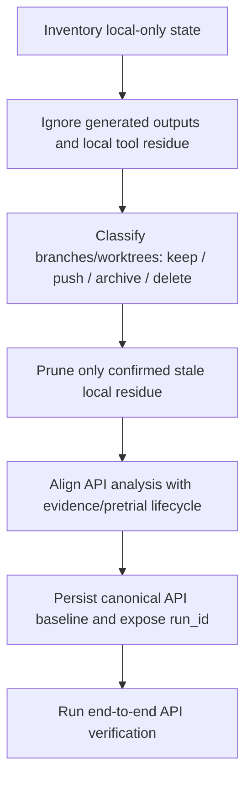

> Historical document.
> Archived during the April 2026 documentation reorganization.
> Kept for context only. Do not treat this file as the current source of truth.
---
title: "fix: repo cleanup and API contract alignment"
type: fix
status: active
date: 2026-03-31
---

# Repo Cleanup And API Contract Alignment

## Overview

当前仓库没有 GitHub 与本地 `main` 的提交漂移，但存在两类明显问题：

1. 本地仓库卫生很差。生成产物、日志、Claude worktree 残留和本地文档混在同一个 checkout 里，已经让 `git status` 失真，增加误提交和误删风险。
2. API 层和仓库已经定义好的核心契约没有对齐。`api/service.py` 仍然绕过 `EvidenceStateMachine`，Scenario API 无法消费 API 自己产出的分析结果，Case 状态也没有落回持久化的 workspace/run 模型。

这份计划把 cleanup 明确拆成两个 workstream：

- **Workstream A: Repo hygiene cleanup**
- **Workstream B: API contract cleanup**

先完成 A，再进入 B。A 只处理本地噪音和仓库可维护性，B 才涉及行为修正和 API 契约调整。

## Problem Frame

当前 checkout 的问题不是“远端代码和本地代码不同”，而是“同一份基线同时承载了太多本地噪音和未收紧契约”：

- `main` 与 `origin/main` 当前同一提交，但工作区中有大量未跟踪内容，导致真实改动难以识别。
- `.gitignore` 没有覆盖 `outputs/`、调试日志、`.claude/worktrees/` 这类本地产物。
- 本地分支和 worktree 数量远高于远端，且存在明显残留目录。
- API analysis / scenario / persistence 三条链路没有落到统一的 `CaseWorkspace` / `Run` / artifact layout 上。

如果不先清理这些问题，后续无论是 review、调试还是交给 Claude 持续开发，都会持续消耗上下文和判断成本。

## Requirements Trace

- R1. 让生成产物和本地 agent/worktree 噪音不再污染主 checkout。
- R2. 在不误删未发布工作的前提下，安全清理本地分支和 worktree 残留。
- R3. 明确区分应提交的本地文档与纯本地产物，避免两者混在同一批清理动作中。
- R4. API analysis 不得再绕过 `EvidenceStateMachine` 或手动提升证据状态。
- R5. API analysis 必须产出可被 Scenario API 直接消费的标准 baseline，并暴露稳定 `run_id`。
- R6. API case/run 状态必须回到仓库现有的持久化模型中，不能只依赖进程内存。
- R7. 补一条覆盖 `create -> extract -> analyze -> scenario` 的真实 API 端到端验证路径。

## Scope Boundaries

- 不在这轮 cleanup 里扩展新功能或新案型。
- 不在这轮 cleanup 里重做 UI。
- 不批量修改历史 plan/brainstorm 文档内容，只做分类和收纳决策。
- 不删除任何未确认归属的本地分支或 worktree。
- 不把 cleanup 和大规模架构重写混成一轮提交。

## Context & Research

### Relevant Code And Artifacts

| Area | Path | Current role |
|------|------|--------------|
| Git ignore rules | `C:/Users/david/dev/case-adversarial-engine/.gitignore` | 仅忽略 `.bulwark/`、`__pycache__`、`*.pyc` |
| CLI outputs | `C:/Users/david/dev/case-adversarial-engine/scripts/run_case.py` | 默认把运行产物写到 `outputs/<timestamp>/` |
| API outputs and in-memory state | `C:/Users/david/dev/case-adversarial-engine/api/service.py` | analysis 只写内存 artifact，DOCX 写到 `outputs/<timestamp>/` |
| Evidence lifecycle contract | `C:/Users/david/dev/case-adversarial-engine/engines/shared/evidence_state_machine.py` | 已定义合法状态迁移 |
| Pretrial integration path | `C:/Users/david/dev/case-adversarial-engine/engines/pretrial_conference/conference_engine.py` | 已具备正式证据流转入口 |
| Persistent workspace model | `C:/Users/david/dev/case-adversarial-engine/engines/shared/workspace_manager.py` | 现有持久化契约，应成为 API 的落点 |
| Scenario baseline loader | `C:/Users/david/dev/case-adversarial-engine/engines/simulation_run/simulator.py` | 从标准 baseline 目录加载 `issue_tree.json` / `evidence_index.json` |
| API tests | `C:/Users/david/dev/case-adversarial-engine/api/tests/test_analysis_endpoints.py` | 当前偏 mock / record injection |
| API tests | `C:/Users/david/dev/case-adversarial-engine/api/tests/test_scenario_endpoints.py` | 当前 patch `scenario_service`，不是端到端 |

### Repo State Driving This Plan

- 本地 `main` 与 `origin/main` 为同一提交 `27de286`
- GitHub open PR: `0`
- 当前已跟踪改动: `1` 个文档 checkbox 变更
- 当前未跟踪文件: `199`
- 本地分支: `125`
- 远端分支: `25`
- 无 upstream 的本地分支: `110`
- 明确 ahead of remote 的本地分支: `feat/v4-ranking-pathtree-actions`
- `.claude/worktrees/` 实际目录数显著高于 `git worktree list` 中登记项

### Existing Patterns To Follow

- 证据状态和访问域已经在架构文档中被定义为受约束系统，不应在 API 层手动改写。
- CLI pipeline 已经知道如何落盘 `issue_tree.json`、`evidence_index.json`、`result.json` 等标准 artifact。
- 仓库文档目录 `docs/plans/` 和 `docs/brainstorms/` 属于 durable artifacts，不应在 hygiene cleanup 中被顺手删除。

## Key Technical Decisions

- **Decision 1: cleanup 分为两个 workstream，而不是一个大杂烩提交。**
  理由：仓库卫生清理和 API 行为修正的风险性质不同。前者主要是本地状态与仓库边界管理，后者会改变 API 可观察行为和持久化契约，必须分开评估。

- **Decision 2: 对本地产物优先采用“忽略 + 收敛目录边界”，而不是先重构输出位置。**
  理由：这轮的首要目标是让 checkout 重新可读。直接补 `.gitignore` 和整理 worktree 残留，比先改所有输出路径更安全、更快见效。

- **Decision 3: 对分支和 worktree 采用“先分类、后删除”的保守策略。**
  理由：当前存在大量无 upstream 分支和未确认 worktree，不能根据名称直接删除。必须先标记为 `keep / push / archive / delete`，再执行清理。

- **Decision 4: API analysis 必须复用正式的 evidence/pretrial/workspace 契约，不再保留平行实现。**
  理由：当前问题不是单点 bug，而是 API 自己走了一条旁路。继续补丁式修正只会扩大双轨行为。

- **Decision 5: Scenario API 应围绕标准 baseline 工作，但 baseline 的生产者改为 API analysis 的标准落盘流程。**
  理由：Scenario loader 已经存在，真正缺的是 API analysis 产出同构 artifact，而不是再造一个 Scenario 私有输入格式。

## Open Questions

### Resolve Before Execution

- `feat/v4-ranking-pathtree-actions` 上领先远端的 1 个提交是要保留并推送，还是直接废弃？
- `docs/superpowers/plans/` 下当前未跟踪文档哪些属于应提交的工作成果，哪些只是本地草稿？

### Deferred To Implementation

- `CaseStore` 应直接替换为 `workspace_manager` 驱动，还是先加一个薄适配层逐步迁移？
- API 层暴露 `run_id` 的位置是分析启动响应、分析结果查询响应，还是两者都暴露？

## High-Level Technical Design

> This diagram shows the intended cleanup flow. It is sequencing guidance, not execution script choreography.

## Implementation Units

- [ ] **Unit 1: Build a cleanup inventory and classify local-only state** `[M]`

  **Goal:** 在不做破坏性操作的前提下，把当前 checkout 中的本地产物、文档、分支和 worktree 分类清楚，形成执行边界。

  **Files / Surfaces:**
  - `C:/Users/david/dev/case-adversarial-engine/.claude/worktrees/`
  - `C:/Users/david/dev/case-adversarial-engine/outputs/`
  - `C:/Users/david/dev/case-adversarial-engine/docs/plans/`
  - `C:/Users/david/dev/case-adversarial-engine/docs/superpowers/plans/`
  - git refs and worktree metadata for this repo

  **Approach:**
  - 明确列出哪些属于 generated artifacts，哪些属于 durable docs，哪些属于 unpublished branch/worktree state。
  - 为分支和 worktree 建立 `keep / push / archive / delete` 分类，不做名称驱动的自动删除。
  - 单独标出所有“本地领先远端”或“无 upstream 但可能有价值”的分支。

  **Test expectation:** none

  **Verification outcomes:**
  - 有一份明确的分类结果，Claude 不需要再自己猜哪些内容可以删。
  - 没有任何未确认归属的 branch/worktree 被删除。

- [ ] **Unit 2: Reduce checkout noise by hardening ignore rules** `[S]`

  **Goal:** 让 `git status` 只暴露真实改动，不再被运行产物、日志和本地工具目录淹没。

  **Files:**
  - `C:/Users/david/dev/case-adversarial-engine/.gitignore`

  **Approach:**
  - 增加对 `outputs/`、调试日志、`.claude/worktrees/` 及其他确定属于本地工具残留的忽略规则。
  - 明确不要把 `docs/plans/`、`docs/brainstorms/`、`docs/solutions/` 这类 durable artifacts 一并忽略。

  **Test expectation:** none

  **Verification outcomes:**
  - `git status` 不再出现批量 `outputs/*` 和 `.claude/worktrees/*` 噪音。
  - 仍能看到真正的代码和文档改动。

- [ ] **Unit 3: Safely prune stale local branches and orphaned worktree directories** `[M]`

  **Goal:** 在保留有价值本地工作的前提下，清理已无远端对应、无登记 worktree、或已被确认废弃的本地残留。

  **Files / Surfaces:**
  - local git branches for this repo
  - `git worktree` registrations for this repo
  - orphaned directories under `C:/Users/david/dev/case-adversarial-engine/.claude/worktrees/`

  **Approach:**
  - 只删除已被 Unit 1 分类为 `delete` 的对象。
  - 对 ahead-of-remote 或无 upstream 但仍有价值的分支，优先 push / archive，而不是删。
  - 对目录存在但 `git worktree list` 不再登记的 orphaned worktree，再做目录级清理。

  **Test expectation:** none

  **Verification outcomes:**
  - `.claude/worktrees/` 中登记项与实际活跃 worktree 基本一致。
  - 本地分支列表不再包含明显废弃的重复/残留分支。

- [ ] **Unit 4: Route API evidence promotion through the canonical lifecycle** `[M]`

  **Goal:** 删除 API 层手动 `private -> admitted_for_discussion` 的旁路，统一走 pretrial / state machine。

  **Files:**
  - `C:/Users/david/dev/case-adversarial-engine/api/service.py`
  - `C:/Users/david/dev/case-adversarial-engine/engines/shared/evidence_state_machine.py`
  - `C:/Users/david/dev/case-adversarial-engine/engines/pretrial_conference/conference_engine.py`
  - `C:/Users/david/dev/case-adversarial-engine/api/tests/test_analysis_endpoints.py`

  **Approach:**
  - 复用现有 pretrial 入口或等价的正式状态迁移接口。
  - 禁止 API analysis 直接写 `ev.status`。
  - 确保证据状态变化同时满足访问域约束，不留下 admitted status / stale access domain 的组合。

  **Test file paths:**
  - `C:/Users/david/dev/case-adversarial-engine/api/tests/test_analysis_endpoints.py`

  **Test scenarios:**
  - analysis 完成后，被引用证据通过合法状态迁移进入可讨论状态，而不是 API 直接赋值。
  - admitted 证据在 API 输出中具有与状态一致的访问域。
  - 未被引用证据不会被错误提升。

  **Verification outcomes:**
  - API analysis 不再出现手动状态提升逻辑。
  - 相关测试能证明 evidence lifecycle 由正式契约驱动。

- [ ] **Unit 5: Make API analysis emit a canonical baseline and stable run identifier** `[M]`

  **Goal:** 让 API analysis 产出的结果与 Scenario API 的输入契约真正打通。

  **Files:**
  - `C:/Users/david/dev/case-adversarial-engine/api/service.py`
  - `C:/Users/david/dev/case-adversarial-engine/api/schemas.py`
  - `C:/Users/david/dev/case-adversarial-engine/api/app.py`
  - `C:/Users/david/dev/case-adversarial-engine/engines/simulation_run/simulator.py`
  - `C:/Users/david/dev/case-adversarial-engine/api/tests/test_analysis_endpoints.py`
  - `C:/Users/david/dev/case-adversarial-engine/api/tests/test_scenario_endpoints.py`

  **Approach:**
  - 让 API analysis 落盘标准 baseline artifact，而不是只保存在 `CaseRecord.artifacts`。
  - 在 API 可见层暴露稳定 `run_id`，使后续 scenario 调用能引用这次 analysis 的标准产物。
  - 不再依赖 `outputs/<timestamp>` 这种只适合人读报告的目录命名作为唯一桥梁。

  **Test file paths:**
  - `C:/Users/david/dev/case-adversarial-engine/api/tests/test_analysis_endpoints.py`
  - `C:/Users/david/dev/case-adversarial-engine/api/tests/test_scenario_endpoints.py`

  **Test scenarios:**
  - 调用 analysis 后，响应或查询结果中能拿到可复用的 `run_id`。
  - Scenario API 能直接基于该 `run_id` 找到 baseline 并成功运行。
  - 缺失 baseline 或无效 `run_id` 时，错误响应明确且稳定。

  **Verification outcomes:**
  - `create -> extract -> analyze -> scenario` 这条路径在 API 层真实可走通。

- [ ] **Unit 6: Replace process-local API state with durable workspace-backed persistence** `[L]`

  **Goal:** 消除 API 进程内存态作为唯一事实来源的问题，让任务可恢复、可回放、可诊断。

  **Files:**
  - `C:/Users/david/dev/case-adversarial-engine/api/service.py`
  - `C:/Users/david/dev/case-adversarial-engine/engines/shared/workspace_manager.py`
  - `C:/Users/david/dev/case-adversarial-engine/engines/shared/job_manager.py`
  - `C:/Users/david/dev/case-adversarial-engine/api/tests/test_analysis_endpoints.py`
  - `C:/Users/david/dev/case-adversarial-engine/api/tests/test_scenario_endpoints.py`
  - `C:/Users/david/dev/case-adversarial-engine/api/tests/test_end_to_end_flow.py`

  **Approach:**
  - 让 API case / run / artifact 生命周期落到现有 workspace/job 模型，而不是只存在 `CaseStore` 字典里。
  - 先优先保证恢复与回放语义，再考虑是否保留内存缓存加速读取。
  - 如果一次性替换风险过大，可先引入薄适配层，让 API 继续保留调用面，但底层事实来源切到持久化对象。

  **Test file paths:**
  - `C:/Users/david/dev/case-adversarial-engine/api/tests/test_analysis_endpoints.py`
  - `C:/Users/david/dev/case-adversarial-engine/api/tests/test_scenario_endpoints.py`
  - `C:/Users/david/dev/case-adversarial-engine/api/tests/test_end_to_end_flow.py`

  **Test scenarios:**
  - analysis 结束后，artifact 和状态可从持久化层重建。
  - 模拟服务重建或重新加载后，已完成 case/run 仍可查询。
  - scenario 调用读取的是持久化 baseline，而不是进程内临时对象。

  **Verification outcomes:**
  - API 状态不再依赖单进程内存才能工作。
  - 端到端测试覆盖完整生命周期而非 mock service。

## System-Wide Impact

- `.gitignore` 变更会影响所有开发者的本地 checkout 感知，需要避免误忽略应提交的文档。
- 分支/worktree cleanup 会直接影响本地开发流，必须保守执行并保留可恢复空间。
- API cleanup 会改变 analysis 和 scenario 的接口行为，应同步检查 `api/app.py`、schema、测试和任何依赖该接口的调用方。
- 持久化接入后，日志、artifact 目录和恢复语义会更接近 CLI pipeline，需要注意不要再形成新的双轨实现。

## Risks & Dependencies

- **Risk:** 误删未发布分支或 worktree。
  **Mitigation:** Unit 1 先分类，Unit 3 只处理确认可删对象。

- **Risk:** `.gitignore` 过宽，导致应提交文档被隐藏。
  **Mitigation:** durable docs 明确列为 protected artifacts；ignore 只覆盖生成产物和工具残留。

- **Risk:** API 契约修正带来接口返回结构变化。
  **Mitigation:** 在 schema 层显式建模 `run_id` 和 baseline 相关字段，并用 API tests 固定行为。

- **Risk:** persistence 改造范围大，容易把 hygiene cleanup 和行为修正混在一起。
  **Mitigation:** 先完成 Workstream A，再单独推进 Workstream B；必要时把 Unit 4-6 再拆成独立提交。

## Recommended Execution Order

1. Unit 1
2. Unit 2
3. Unit 3
4. Unit 4
5. Unit 5
6. Unit 6

Workstream A 完成标准：

- checkout 噪音显著下降
- stale worktree / branch 已按分类处理
- `git status` 可读

Workstream B 完成标准：

- evidence lifecycle 不再被 API 绕过
- API analysis 与 scenario 共享标准 baseline
- API 状态可恢复、可回放
- 有真实端到端验证覆盖整条链路

## Final Verification

- 本地 checkout 中，生成产物和工具残留不再掩盖真实改动。
- 不存在未确认归属就被删除的分支或 worktree。
- API analysis / scenario / persistence 的契约统一到 `CaseWorkspace` / `Run` / canonical artifacts。
- 至少有一条真实 API 端到端测试覆盖 `create -> extract -> analyze -> scenario`。

