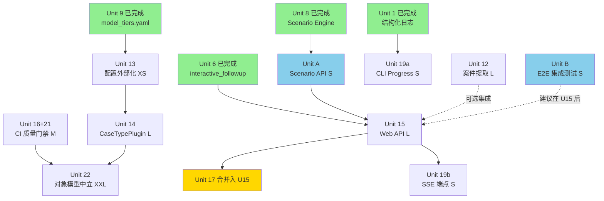

> Historical document.
> Archived during the April 2026 documentation reorganization.
> Kept for context only. Do not treat this file as the current source of truth.
---
date: 2026-03-31
topic: phase4-5-assessment
type: assessment
status: active
---

# Phase 4-5 评估文档：Unit 12-22 逐项分析与重新规划

## 背景

本文档基于 Phase 1-3 全部完成后的现状，对原始路线图中 Phase 4（Unit 12-15）和 Phase 5（Unit 16-22）进行逐项评估，给出保留/修改/删除/合并建议，并提供重新排序的优先级和执行顺序。

## Phase 1-3 完成状态摘要

**测试覆盖：1520 个测试全部通过（原规划 930+，实际增长 63%）**

| Unit | 名称 | 状态 | 关键产出 |
|------|------|------|---------|
| Unit 1 | 结构化日志 + Token 追踪 | ✅ 完成 | `engines/shared/logging_config.py` |
| Unit 2 | PII 脱敏 + 免责声明 | ✅ 完成 | `pii_redactor.py`, `disclaimer_templates.py` |
| Unit 3 | Checkpoint Resume | ✅ 完成 | `engines/shared/checkpoint.py` |
| Unit 4 | 三模块测试补全 | ✅ 完成 | defense_chain/hearing_order/issue_dependency_graph 测试 |
| Unit 5 | pretrial_conference 接入 | ✅ 完成 | pipeline 全链路 evidence_state_machine |
| Unit 6 | interactive_followup 可用化 | ✅ 完成 | session_manager + 错误恢复 |
| Unit 7 | 模块间数据流断点修复 | ✅ 完成 | pipeline 数据传递完整 |
| Unit 8 | Scenario Engine what-if | ✅ 完成 | `simulator.py` + `scripts/run_scenario.py` |
| Unit 9 | 多模型分级策略 | ✅ 完成 | `model_selector.py` + `config/model_tiers.yaml` |
| Unit 10 | Few-shot Examples | ✅ 完成 | 关键 prompt 增强 |
| Unit 11 | 报告增强 | ✅ 完成 | 风险热力图、调解区间、对手策略警告 |

**当前 Web API 端点清单（`api/app.py`）：**
```
POST   /api/cases/
GET    /api/cases/{case_id}
POST   /api/cases/{case_id}/materials
POST   /api/cases/{case_id}/materials/upload
POST   /api/cases/{case_id}/extract         (202 异步)
GET    /api/cases/{case_id}/extraction
POST   /api/cases/{case_id}/confirm
POST   /api/cases/{case_id}/analyze         (202 异步)
GET    /api/cases/{case_id}/analysis
GET    /api/cases/{case_id}/report
GET    /
```

**已有基础设施：** `job_manager.py`（异步任务管理）、`workspace_manager.py`（工作区管理）已在 Phase 1-3 建立。

---

## Phase 4 逐项评估（Unit 12-15）

### Unit 12：案件输入简化（文本自动提取 → YAML）

**原始定义：** 从起诉状、答辩状等原始文本自动提取结构化 YAML。

**评估：保留，优先级不变**

Phase 1-3 未改变此 Unit 的上下文。`engines/case_structuring/case_extractor/` 目录不存在，属于全新能力建设。

**影响 Phase 1-3 的变化：**
- Unit 5 完成后 pipeline 接受的 YAML 格式已稳定，case_extractor 的输出目标明确
- Unit 9 的 `ModelSelector` 可被 extractor 直接复用（LLM 调用通过 balanced tier）
- Unit 7 的数据流修复使 `_load_case()` 入口更清晰，extractor 目标格式有参照

**修改建议：**
- 原依赖标注为 `None（可并行开发）`——**仍然正确**，可提前到 Phase 4 第一批并行启动
- 新增建议：提取结果应通过现有 API 的 `/extract` 端点集成（而非仅 CLI），与 Unit 15 协调

**风险：低。** 这是新增模块，不触碰现有 1520 测试。

---

### Unit 13：配置文件外部化

**原始定义：** 将硬编码配置提取到 `config/engine_config.yaml`，创建 `config_loader.py`。

**评估：修改——Scope 显著缩小**

Unit 9 已经完成了外部化模式的主要工作：
- `config/model_tiers.yaml` 已存在并运行良好
- `engines/shared/model_selector.py` 已实现从 YAML 加载配置的完整模式
- 配置优先级（CLI > config > 默认值）的模式已在 ModelSelector 中被验证

**实际剩余工作（重新定义）：**
只需创建 `config/engine_config.yaml`，使其与 `model_tiers.yaml` 同层级、同格式：
```yaml
# config/engine_config.yaml
pipeline:
  max_retries: 3
  timeout_seconds: 120
  output_dir: outputs/

report:
  include_disclaimer: true
  redact_pii: true

interactive:
  max_question_length: 2000
  max_session_turns: 20
```

并在 `config_loader.py` 中统一加载两个 YAML（`engine_config.yaml` + `model_tiers.yaml`），提供单一配置入口。

**修改内容：**
- 原 Size 评估 `[S]` 现在应降为 `[XS]`（仅需创建 YAML + 简单加载器）
- 文件修改范围缩减：不需要改 `cli_adapter.py`（已通过 ModelSelector 间接配置）
- 依赖 Unit 9 的状态已满足，可立即执行

**风险：极低。** 扩展现有模式，不破坏任何现有逻辑。

---

### Unit 14：CaseTypePlugin 接口

**原始定义：** 设计 Protocol + Registry，将 civil_loan 逻辑封装为插件，支持多案种扩展。

**评估：保留，但降低优先级，移至 Phase 5 末尾**

**重新评估理由：**
- Unit 22（对象模型中立化）依赖 Unit 14，而 Unit 22 是最大风险项
- Unit 14 本身不产生用户可见的功能价值，是内部架构改善
- 当前 civil_loan pipeline 运行良好，没有紧迫痛点驱动此工作
- 1520 测试的爆炸半径使 Unit 14 → Unit 22 的连锁重构风险显著增大

**保留理由：**
- 仍然是正确的架构方向
- 新案种需求迟早会来，提前建立接口可降低未来成本

**建议：** 保留 Unit 14，但作为 Phase 5 的最后项目执行（Unit 22 之前）。给时间让 Phase 4/5 其他工作积累更多稳定测试基线。

**风险：中。** 需要触碰 `models.py`（1747 行），但比 Unit 22 小。

---

### Unit 15：Web API 完善

**原始定义：** 增加 `GET /cases/{id}/result`、`POST /cases/{id}/followup`、`GET /cases/{id}/artifacts/{name}`。

**评估：修改——需扩展范围 + 处理异步设计**

**发现的缺口 1：Scenario Engine 端点缺失**

Unit 8 已完成 `scripts/run_scenario.py` + `ScenarioSimulator`，但 Web API 没有对应端点。当前 API 用户无法通过 HTTP 触发 what-if 分析。需要新增：
```
POST /api/cases/{case_id}/scenarios      (202 异步，触发 scenario 分析)
GET  /api/cases/{case_id}/scenarios/{scenario_id}  (查询结果)
```

**发现的缺口 2：异步设计一致性**

Pipeline 运行耗时较长（多轮 LLM 调用）。原规划中 Unit 15 的设计是"追问端点复用 FollowupResponder + SessionManager"，但没有明确追问是否也走 202 异步模式。

现有 API 已建立良好的 202 异步模式（`job_manager.py` + 轮询端点），`followup` 端点应遵循相同模式，而非同步阻塞。

**修改内容：**
- 新增：`POST /api/cases/{case_id}/scenarios`（202 异步）
- 新增：`GET /api/cases/{case_id}/scenarios/{scenario_id}`（结果查询）
- 追问端点改为异步模式（非阻塞）
- 原定端点全部保留（`/result`、`/followup`、`/artifacts/{name}`）

**依赖说明：** `job_manager.py` 和异步基础设施已存在，这些端点可以直接复用现有模式。

**风险：低-中。** 扩展现有 API，但 scenario 端点需要集成 `ScenarioSimulator`，需要仔细处理 workspace/output 路径。

---

## Phase 5 逐项评估（Unit 16-22）

### Unit 16：CI Benchmark 启用

**原始定义：** `.github/workflows/benchmark.yml` + mock LLM benchmark runner。

**评估：合并 → 与 Unit 21 合并为「CI 质量门禁」**

Unit 16（CI benchmark）和 Unit 21（benchmark 回归）目标高度重叠，且 Unit 21 依赖 Unit 16。分开实施会导致：
1. 两次 CI 配置修改
2. 两次 `benchmarks/` 目录结构变更
3. 逻辑上的重复工作（benchmark runner 建两遍）

**合并后定义（新 Unit 16+21）：**
一次实施「CI 质量门禁」：
- 创建 `benchmarks/golden_outputs/` + `scripts/run_regression.py`
- CI workflow 同时运行 benchmark（mock LLM）+ 回归对比
- PR comment 展示 benchmark 结果和回归状态
- Size 从 `[S]+[M]` = `[M]` 合并为单次 `[M]`

**风险：低。** 新增 CI 配置，不触碰现有代码。

---

### Unit 17：FastAPI 端点测试

**原始定义：** 为 FastAPI 端点补充 `httpx.AsyncClient` 自动化测试。

**评估：合并 → 附属于 Unit 15**

Unit 15 扩展 API 端点，Unit 17 为这些端点写测试。两者在时间上完全耦合——Unit 15 完成后立刻需要 Unit 17，分开独立执行会在 Unit 15 完成与 Unit 17 开始之间留下窗口期的测试空白。

**建议：** 将 Unit 17 作为 Unit 15 的组成部分（"Unit 15 必须包含完整的 API 测试"），不单独列为工作项。

这也与项目现有规范一致：其他模块（pretrial_conference、interactive_followup 等）都是在实现时同步写测试，而不是分批补测。

---

### Unit 18：法条引用白名单验证

**原始定义：** 从 LLM 输出中提取法条引用，与 JSON 白名单对比，标记为 `verified/unverified/deprecated`。

**评估：删除（当前阶段）**

**删除理由：**

1. **噪音风险大于价值：** LLM 输出的法条引用格式多样（"《民法典》第667条"、"民法典第六百六十七条"、"民法典第667条"等），标准化难度高，误判率会导致大量误报，降低报告可信度。

2. **维护成本持续高：** 法条库（civil_loan.json）需要随法律更新同步维护，这是一个持续的运营负担，但当前项目没有配套的法律内容运营流程。

3. **Unit 14 依赖尚未就绪：** 原规划依赖 Unit 14 的 `CaseTypePlugin.legal_articles()` 接口，而 Unit 14 已被降至 Phase 5 末尾，Unit 18 依赖链被破坏。

4. **更高价值的替代方案：** 如果需要法条验证，更好的方案是在 prompt 层面引导 LLM 输出标准化法条 ID（而非后处理识别），这是 prompt engineering 工作，成本更低、效果更好。

**建议：** 删除 Unit 18。若未来确实需要法条验证，以新 Unit 形式重新规划，从 prompt 层面解决。

---

### Unit 19：Streaming + Partial Output

**原始定义：** `ProgressReporter` Protocol + CLI stderr 输出 + API SSE 端点。

**评估：保留，拆分为两个独立部分**

**Phase 1-3 对此 Unit 的积极影响：**
- Unit 1 完成的结构化日志已建立事件流基础（`logging_config.py` 输出 JSON 格式）
- `job_manager.py` 已有任务状态管理，SSE 可以直接消费 job events

**拆分建议：**

**19a（高价值，应做）：CLI ProgressReporter**
- `engines/shared/progress_reporter.py`
- 替换 `scripts/run_case.py` 中的 `print()` 调用
- stderr 输出结构化进度（step start/complete/error）
- 依赖：无，可立即实施
- Size: `[S]`

**19b（中价值，可选）：API SSE 端点**
- `api/app.py` 增加 SSE 端点 `GET /api/cases/{case_id}/events`
- 消费 `job_manager` 的事件推送进度
- 依赖：Unit 15（API 完善后再扩展）
- Size: `[S]`

**建议：** 19a 在 Phase 4 就做（与 Unit 15 同批），19b 作为 Phase 5 可选项。

**风险：低。** 19a 是纯新增，不触碰现有逻辑。19b 扩展已有 API。

---

### Unit 20：DOCX 增强

**原始定义：** 目录页、改善表格样式、页眉页脚、附录章节。

**评估：保留，但降为可选**

Unit 11 已完成报告增强（风险热力图、调解区间），DOCX 已有对应章节更新。Unit 20 的工作是格式美化（TOC、样式、页眉），不涉及新内容。

在 1520 测试的背景下，`docx_generator.py` 的修改风险可控（DOCX 测试通过 `python-docx` mock）。

**建议：** 保留为 Phase 5 中优先级最低的项目。如果时间紧张可跳过，不影响功能正确性。

**风险：低。** 格式变更不影响数据逻辑。

---

### Unit 21：自动化评测 Benchmark 回归

**见 Unit 16 的合并评估。** Unit 21 已并入 Unit 16 形成「CI 质量门禁」。

---

### Unit 22：对象模型案型中立重构

**原始定义：** 重构 `models.py`（1747行）拆分为 `models_base.py` + 案种专用模型，依赖 Unit 14。

**评估：推迟——风险级别升高为 HIGH**

**风险升级的核心原因：**

原规划的验收标准是"930+ 测试全部通过"，但当前实际测试数量是 **1520**，爆炸半径增大 **63%**。

具体风险点：
1. `models.py` 被 Phase 1-3 新增的大量测试广泛引用（logging、checkpoint、scenario 等模块都导入 models）
2. 字段拆分会触发所有 import 路径变化，即使是无意义的字段移动也会导致大量测试 `ImportError`
3. Phase 1-3 的新增代码路径（interactive_followup session、scenario output schema 等）与 models.py 的耦合程度远高于原来估计

**建议：** 推迟到整个 Phase 5 末尾，且前置条件是：
- Unit 14（CaseTypePlugin 接口）已稳定运行至少一个 release
- CI 质量门禁（Unit 16+21）完整工作，能够快速检测回归
- 团队有专注的一周时间做此重构，不被其他工作打断

**Size 重新评估：** 原标注 `[XL]`，实际应为 `[XXL]`（2周+）。

---

## 建议新增工作项

### 新 Unit A：Scenario API 端点集成（从 Unit 15 拆出独立跟踪）

**背景：** Unit 8 完成了 CLI 的 scenario what-if，但 Web API 完全没有对应能力。这是一个端到端能力缺口。

**工作内容：**
- `POST /api/cases/{case_id}/scenarios`：接受 `ScenarioInput`（change_set），触发异步 scenario 分析
- `GET /api/cases/{case_id}/scenarios/{scenario_id}`：查询 Scenario 结果
- 复用 `job_manager` 的异步任务模式
- 复用 `ScenarioSimulator.simulate()` 现有实现

**Size：** `[S]`（现有基础设施完备，只需接线）

**Priority：** P1（功能完整性要求）

---

### 新 Unit B：API 端到端集成测试

**背景：** Unit 17 建议合并入 Unit 15，但随着 API 端点增加（Unit 15 扩展 + Scenario 端点），需要一个覆盖完整用户流程的端到端测试：
```
POST /cases → POST /materials → POST /extract → POST /confirm → POST /analyze → GET /analysis → GET /report
```

与 Unit 17 的区别：Unit 17 是单端点测试，Unit B 是业务流程测试。

**Size：** `[S]`

**Priority：** P2（质量保障）

---

## 重新排序的优先级建议

| 优先级 | Unit | 名称 | Size | 理由 |
|--------|------|------|------|------|
| **P0** | 13 | 配置外部化（缩减版） | XS | 最快交付，零风险，使后续 Unit 配置更灵活 |
| **P1** | 12 | 案件输入简化 | L | 核心用户价值，全新能力，不触碰现有代码 |
| **P1** | 19a | CLI ProgressReporter | S | 依赖 Unit 1 已就绪，快速交付开发体验改善 |
| **P1** | 15 + 17 | Web API 完善（含测试） | L | 产品完整性，同步写测试 |
| **P1** | Unit A | Scenario API 端点 | S | 填补 Unit 8 的 API 缺口 |
| **P2** | 16+21 | CI 质量门禁 | M | 为 Unit 22 的高风险重构提供安全网 |
| **P2** | 19b | API SSE 端点 | S | 依赖 Unit 15，可选的用户体验改善 |
| **P2** | 20 | DOCX 增强 | S | 格式美化，不影响功能 |
| **P2** | Unit B | API 端到端集成测试 | S | 质量保障 |
| **P3** | 14 | CaseTypePlugin 接口 | L | 架构改善，无紧迫用户需求驱动 |
| **P3** | 18 | ~~法条引用验证~~ | - | **删除** |
| **P3** | 22 | 对象模型中立化 | XXL | 最高风险，需要 Unit 14 + CI 门禁前置 |

---

## 依赖关系图



**图例：**
- 绿色：Phase 1-3 已完成节点
- 金色：合并入其他 Unit 的节点
- 蓝色：新增工作项

---

## 风险评估

### 高风险项

| 风险项 | 风险描述 | 缓解措施 |
|--------|---------|---------|
| **Unit 22** | 1520 测试爆炸半径；`models.py` 被全项目引用 | 前置 Unit 14 + CI 门禁；安排专注窗口期；渐进式拆分 |
| **Unit 15 Scenario 集成** | ScenarioSimulator 的 workspace/output 路径管理与 API job 模式耦合复杂 | 先写 Unit A（独立），再与 Unit 15 合并 |

### 中风险项

| 风险项 | 风险描述 | 缓解措施 |
|--------|---------|---------|
| **Unit 14** | 触碰 `models.py`；插件注册模式影响全引擎 | 小步提交；Phase 1-3 测试作为回归基线 |
| **Unit 12** | LLM 提取 YAML 的 schema 验证可能需要多次迭代 | 初版放宽验证要求；提示用户补全缺失字段 |

### 低风险项

| 风险项 | 风险描述 | 缓解措施 |
|--------|---------|---------|
| **Unit 13** | 极小，只新增配置文件 | 无需特别措施 |
| **Unit 19a** | 纯新增 ProgressReporter | 测试覆盖 reporter 协议 |
| **Unit 16+21** | CI 配置变更 | 先在 branch 上验证 |
| **Unit 20** | DOCX 格式修改 | 手动验证 Word 兼容性 |

### 已删除的风险项

- **Unit 18（法条引用验证）**：删除后，误报噪音风险消除。

---

## 推荐的执行顺序

### 批次 1（可立即开始，并行执行）

**目标：** 快速交付配置外部化 + 为 Phase 4 大工作奠基

- `Unit 13`（配置外部化 XS）— 1天
- `Unit 19a`（CLI ProgressReporter S）— 1天

这两项零依赖、零风险，可并行。

---

### 批次 2（批次 1 完成后，并行执行）

**目标：** 核心平台能力

- `Unit 12`（案件输入简化 L）— 独立，全新模块
- `Unit A`（Scenario API S）— 独立，复用现有 ScenarioSimulator
- `Unit 15 + 17`（Web API + 测试 L）— 在 Unit A 完成后合并 Scenario 端点

Unit 12 与 Unit A/15 完全并行。Unit A 应在 Unit 15 开始前完成，使 Scenario 端点能整合进 Unit 15 的实施范围。

---

### 批次 3（批次 2 完成后）

**目标：** 质量保障基础设施

- `Unit 16+21`（CI 质量门禁 M）— 为 Unit 22 提供安全网
- `Unit B`（API E2E 集成测试 S）— 在 Unit 15 完成后立即跟进
- `Unit 19b`（API SSE 端点 S）— 在 Unit 15 完成后可选

这批工作不产生功能，但为后续高风险重构提供保障。

---

### 批次 4（批次 3 完成后）

**目标：** 架构演进（需要安全网就绪）

- `Unit 14`（CaseTypePlugin L）— CI 门禁已就位，可安全进行架构改动
- `Unit 20`（DOCX 增强 S）— 低风险，可随时穿插

---

### 批次 5（批次 4 稳定后，需专注窗口）

**目标：** 最终重构（最高风险）

- `Unit 22`（对象模型中立 XXL）— 需要 Unit 14 + CI 门禁 + 专注时间窗口

---

### 时间线概览

```
批次 1  ██  (2-3天)
批次 2  ████████████  (1-2周)
批次 3  ██████  (3-5天)
批次 4  ████████  (1周)
批次 5  ████████████████  (2周+)
```

---

## 关键决策记录

| 决策 | 选择 | 理由 |
|------|------|------|
| Unit 13 Scope | 缩减为 XS | Unit 9 已建立外部化模式，只需扩展 |
| Unit 15 范围 | 扩展增加 Scenario 端点 | Unit 8 完成了 CLI 但 API 有缺口，需要端到端闭环 |
| Unit 17 归属 | 合并入 Unit 15 | 测试应与实现同步，不宜分批 |
| Unit 18 | 删除 | 噪音风险 > 价值，法条维护成本过高，依赖链断裂 |
| Unit 21 归属 | 合并入 Unit 16 | 两者高度重叠，一次完成更高效 |
| Unit 22 时序 | 推迟至 Phase 5 末尾 | 测试数量从 930+ 涨到 1520，爆炸半径不可低估 |
| Unit 19 拆分 | 19a（CLI）先行，19b（SSE）可选 | CLI Progress Reporter 独立价值高，SSE 依赖 API 完善 |

---

## 附：Phase 4-5 修订后工作项清单

| # | 工作项 | 原 Unit | 优先级 | Size | 依赖 | 状态 |
|---|--------|---------|--------|------|------|------|
| 1 | 配置外部化 | Unit 13 | P0 | XS | 无 | 待执行 |
| 2 | CLI ProgressReporter | Unit 19a | P1 | S | Unit 1✅ | 待执行 |
| 3 | 案件输入简化 | Unit 12 | P1 | L | 无 | 待执行 |
| 4 | Scenario API 端点 | Unit A（新增） | P1 | S | Unit 8✅ | 待执行 |
| 5 | Web API 完善（含测试） | Unit 15+17 | P1 | L | Unit A, Unit 6✅ | 待执行 |
| 6 | CI 质量门禁 | Unit 16+21 | P2 | M | 无 | 待执行 |
| 7 | API E2E 集成测试 | Unit B（新增） | P2 | S | Unit 15 | 待执行 |
| 8 | API SSE 端点 | Unit 19b | P2 | S | Unit 15 | 待执行（可选）|
| 9 | DOCX 增强 | Unit 20 | P2 | S | Unit 11✅ | 待执行（可选）|
| 10 | CaseTypePlugin 接口 | Unit 14 | P3 | L | Unit 16+21 | 待执行 |
| 11 | 对象模型中立化 | Unit 22 | P3 | XXL | Unit 14, Unit 16+21 | 待执行 |
| ~~12~~ | ~~法条引用白名单~~ | ~~Unit 18~~ | ~~P2~~ | ~~M~~ | ~~已删除~~ | ~~删除~~ |

