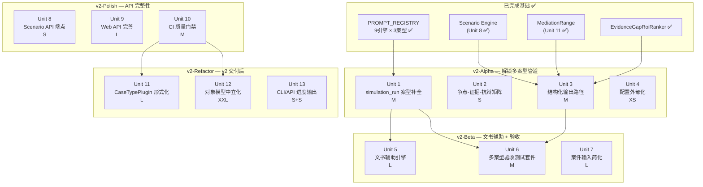

> Historical document.
> Archived during the April 2026 documentation reorganization.
> Kept for context only. Do not treat this file as the current source of truth.
---
title: "feat: v2 民事通用内核 Beta 实施规划"
type: feat
status: active
date: 2026-03-31
origin: docs/plans/2026-03-31-ce-brainstorm-v2-alignment.md
---

# feat: v2 民事通用内核 Beta 实施规划

## Overview

基于 v2 对齐评估（`docs/plans/2026-03-31-ce-brainstorm-v2-alignment.md`），本规划将 v2 Must Have 分解为 **13 个可执行工作单元**，分 4 个 Phase 推进。

**v2 发布必须（v2-Alpha + v2-Beta）**：解锁多案型端到端管道（Unit 1）、争点-证据-抗辩矩阵（Unit 2）、结构化输出路径（Unit 3）、文书辅助引擎（Unit 5）、多案型验收测试套件（Unit 6）。
**v2 发布后（v2-Polish + v2-Refactor）**：Web API 完整性、CI 质量门禁、CaseTypePlugin 形式化、对象模型拆分。

评估核心发现：系统基础设施比预想成熟（统一对象模型 ~85%、PROMPT_REGISTRY 在 9 引擎 × 3 案型全面落地、Scenario Engine 100% 完成），但 simulation_run 层 6 个分析模块仅有 civil_loan prompt，阻断多案型端到端路径；文书辅助（v2 Must Have #4）和结构化输出路径（v2 Must Have #3）在任何已有计划中均未覆盖。

## Problem Frame

v2 产品目标"民事通用内核 Beta"要求从单案型工具升级为支持 3-5 个民事案型的通用内核。当前 v2 Must Have 完成度：

| v2 Must Have | 完成度 | 核心缺口 |
|------|--------|---------|
| 统一对象模型（Party/Claim/Defense/Issue/Evidence/Burden/ProcedureState） | ~85% | models.py 单文件但对象已中立；拆分（Unit 12）推迟到 v2 后 |
| 案型插件机制 | ~70% | simulation_run 层 6 模块仅 civil_loan（**v2-Gap-1，阻塞点**） |
| 输出升级：胜诉/败诉/调解/补证路径 | ~35% | 散落 4 个产物，无统一 OutcomePath 结构（v2-Gap-3） |
| 文书辅助：起诉状/答辩状/质证意见框架 | **0%** | 完全空白，任何已有计划未覆盖（v2-Gap-2） |
| 支持增删证据/切换场景/比较差异 | 100% | 仅缺 Web API 端点（v2-Polish Unit 8） |

当前最大阻塞点：`action_recommender`、`attack_chain_optimizer`、`decision_path_tree`、`defense_chain`、`issue_category_classifier`、`issue_impact_ranker` 6 个模块只有 `prompts/civil_loan.py`，labor_dispute 和 real_estate 案件无法完整运行 simulation_run 阶段。（see origin: §1.2）

## Requirements Trace

- R1. simulation_run 层 6 模块全部支持 civil_loan、labor_dispute、real_estate → Unit 1
- R2. 争点-证据-抗辩矩阵可稳定生成（IssueTree × EvidenceIndex × DefenseChain 三维关联）→ Unit 2
- R3. 胜诉/败诉/调解/补证路径聚合为统一 `CaseOutcomePaths` 结构，路径可独立读取 → Unit 3
- R4. 起诉状/答辩状/质证意见框架可从 IssueTree + EvidenceIndex 生成 → Unit 5
- R5. 多案型验收测试套件就位（最少 3 案件 × 3 案型），批量回放可自动运行 → Unit 6
- R6. v2 正式发布门禁：5 个案型各通过 10 个历史案件回放 → Unit 6 扩展阶段
- R7. 对象模型不因案型变化重命名 → 当前对象已足够中立，Unit 12（v2 后）形式化
- R8. Scenario 差异输出可解释 → Unit 3 的 OutcomePath 将 Scenario 差异对应到路径变化
- R9. 文书框架律师人工修改量明显下降 → Unit 5 交付后人工评审验证

## Scope Boundaries

- **不在 v2 发布路径**：Unit 22/Unit 12（models.py 拆分）— 对象已中立，拆分是工程卫生
- **不在 v2 发布路径**：Unit 14/Unit 11（CaseTypePlugin Protocol 形式化）— PROMPT_REGISTRY 已够用
- **不在 v2 发布路径**：Unit 19a/b/Unit 13（进度输出）、Unit 20（DOCX 增强）、Unit B（API E2E 集成测试）
- **不承诺 v2-Alpha/Beta 覆盖 5 案型**：目标是 civil_loan + labor_dispute + real_estate 3 案型走通 v2 能力
- **不承诺文书辅助自由生成完整文书**：v2 初版采用结构化填空（schema 定义骨架，LLM 填充内容项）
- **不做 UI**：所有交付以 CLI + API 为界面
- **不做刑事/行政**：本版本仅民事

## Context & Research

### Relevant Code and Patterns

| 路径 | 说明 |
|------|------|
| `engines/simulation_run/action_recommender/prompts/civil_loan.py` | 标准 simulation_run prompt 文件结构，Unit 1 新增文件遵循此模式 |
| `engines/simulation_run/*/prompts/__init__.py` | PROMPT_REGISTRY 注册表，Unit 1 在此注册新 case_type |
| `engines/report_generation/schemas.py` | 报告 schema，Unit 2/3 新增 schema 于此文件 |
| `engines/report_generation/mediation_range.py` | MediationRange 实现，Unit 3 调解路径的数据来源 |
| `engines/report_generation/risk_heatmap.py` | "多产物聚合为报告组件"模式，Unit 2/3 遵循 |
| `engines/simulation_run/evidence_gap_roi_ranker/` | EvidenceGapRoiRanker，Unit 3 补证路径数据来源 |
| `engines/simulation_run/decision_path_tree/` | DecisionPathTree，Unit 3 胜/败路径条件数据来源 |
| `engines/shared/models.py` | 统一对象模型；Unit 2/3 新增 schema 放 report_generation/schemas.py，不放此文件 |
| `engines/pretrial_conference/cross_examination_engine.py` | 单证据级质证意见生成，Unit 5 的 LLM 调用模式参考 |
| `cases/wang_v_chen_zhuang_2025.yaml` | 现有 case YAML 格式，Unit 6 新案件遵循同一结构 |
| `scripts/run_case.py` | 主 pipeline 入口，Unit 5 文书辅助引擎接入点 |

### 已有测试模式

- 测试文件位置：`engines/<module>/tests/test_*.py` + `test_schemas.py`（schema 验证）+ `test_contract.py`（注册表一致性）
- LLM mock：`conftest.py` 的 `mock_llm_client` fixture，patch `asyncio.sleep`
- async 测试：`pytest-asyncio asyncio_mode = "auto"`
- 注册表完整性：`test_contract.py` 验证所有已注册 case_type 键集合完整

## Key Technical Decisions

- **simulation_run 6 模块采用纯 prompt 扩展，不改引擎逻辑**：对齐评估确认 6 模块均遵循 PROMPT_REGISTRY 模式（`prompts/__init__.py` + `prompts/civil_loan.py`）；新增 case_type 只需新文件 + 注册，零架构变更。这是解锁多案型最低风险路径。（see origin: §1.2 表格，§二 Unit 14 分析）

- **OutcomePath + IssueEvidenceDefenseMatrix 放 `report_generation/schemas.py`，不放 `shared/models.py`**：两者是报告层的输出聚合结构，不是核心领域对象。遵循现有分层惯例（MediationRange 在 report_generation），避免 models.py 继续膨胀。

- **文书辅助新建独立引擎 `engines/document_assistance/`**：与 pretrial_conference 隔离（pretrial 负责程序阶段，document_assistance 负责文书生成）；从 report_generation 层调用，与 DOCX 导出自然集成。单一职责，避免两个生成引擎耦合。

- **文书辅助 v2 初版采用结构化填空策略**：schema 定义文书结构骨架（固定章节、条款位置），LLM 只填充 `List[str]` 中的具体内容条目，不决定结构布局。理由：降低 LLM 随机性风险；v2 验收标准"律师修改量下降"通过结构稳定性更易保证。（see origin: §七 被低估的风险）

- **验收测试套件最小可用目标：3 案件 × 3 案型**：路线图要求 10×5，但样本库建设有人力成本不确定性。3+3+3 解锁自动化验收框架和指标体系，10×5 作为 v2 正式发布门禁。分离"能力可验收"和"样本库完整"，避免样本收集阻塞能力交付。

- **Unit 22（models.py 拆分）不进入 v2 发布路径**：当前 Party/Claim/Defense 等对象已足够中立；"对象模型不因案型变化而重命名"的 v2 验收标准在不拆分的情况下可满足。拆分是 XXL 工程风险，不应成为 v2 压力。（see origin: §七）

## Open Questions

### Resolved During Planning

- **Q: simulation_run 6 模块是否都遵循 PROMPT_REGISTRY 模式？** → 是。代码库确认 6 模块均有 `prompts/__init__.py` + `prompts/civil_loan.py` 结构。（see origin: §1.2）
- **Q: Unit 22 是否是 v2 硬性前置？** → 否。v2 验收"对象模型不因案型变化而重命名"在当前 models.py 下可满足。
- **Q: OutcomePath 聚合是否需要新 LLM 调用？** → 否。聚合逻辑是纯数据变换；DecisionPathTree + MediationRange + EvidenceGapRoiRanker 已有所需数据。
- **Q: 文书辅助是否需要从零建立引擎？** → 是，但 `pretrial_conference/cross_examination_engine.py` 提供了 LLM 调用模式参考。
- **Q: Phase 4-5 工程基建项是否是 v2 硬性前置？** → 否。v2 可在当前基础设施上直接开始，先做 Gap 工作。（see origin: §四）

### Deferred to Implementation

- **Q: 文书辅助 few-shot examples 选哪些案例？** → 实现时从 `cases/` 目录选择，或建立 `examples/` 专用目录；civil_loan 使用 `wang_v_chen_zhuang_2025.yaml`。
- **Q: 矩阵输出是否需要 JSON + Markdown 双模？** → 建议双模（schema 存 JSON，report 渲染 Markdown），实现时确认报告渲染约束。
- **Q: run_acceptance.py 一致性指标的具体算法？** → 参考现有 `test_simulator.py` 中 run_to_run_consistency 测试模式，实现时确认。
- **Q: 第 4、5 案型何时纳入？** → v2-Beta 完成 3 案型验收后，视样本库进展决定；不阻塞 v2 发布。

## High-Level Technical Design

> *This illustrates the intended approach and is directional guidance for review, not implementation specification. The implementing agent should treat it as context, not code to reproduce.*

### Phase 依赖关系图



### OutcomePath 数据聚合流

```
DecisionPathTree.outcome_branches
      → OutcomePath(type=WIN,  trigger_conditions, risk_points)
      → OutcomePath(type=LOSE, trigger_conditions, risk_points)

MediationRange.range_analysis.settlement_zone + bottom_lines
      → OutcomePath(type=MEDIATION, key_actions, trigger_conditions)

EvidenceGapRoiRanker.ranked_gaps[:3]
      → OutcomePath(type=SUPPLEMENT, key_actions, required_evidence_ids)

4 × OutcomePath → CaseOutcomePaths → report_generator → Markdown + JSON
```

### 文书辅助引擎数据流

```
IssueTree + EvidenceIndex + OptimalAttackChain
  → DocumentAssistanceEngine.generate(doc_type, case_type)
      → StructuredFillStrategy
          → schema 骨架 (PleadingDraft / DefenseStatement / CrossExaminationOpinion)
          → LLM 填充 content items (List[str])
      → DocumentDraft (骨架 + 填充内容 + evidence_ids_cited)
          → report_generation 集成
          → DOCX 导出章节
```

---

## Implementation Units

### Phase v2-Alpha：解锁多案型管道

---

- [ ] **Unit 1: simulation_run 层 6 模块案型补全**

**Goal:** 为 simulation_run 层的 6 个分析模块（action_recommender、attack_chain_optimizer、decision_path_tree、defense_chain、issue_category_classifier、issue_impact_ranker）补全 labor_dispute 和 real_estate 的 prompt 文件，并注册到各模块的 PROMPT_REGISTRY，使 labor_dispute 和 real_estate 案件可完整运行 simulation_run 阶段。

**Size:** M（12 个新 prompt 文件，6 模块 × 2 案型）

**Requirements:** R1, R2

**Dependencies:** PROMPT_REGISTRY 模式已就绪（D4 ✅）

**Files:**
- Create: `engines/simulation_run/action_recommender/prompts/labor_dispute.py`
- Create: `engines/simulation_run/action_recommender/prompts/real_estate.py`
- Modify: `engines/simulation_run/action_recommender/prompts/__init__.py`
- Create: `engines/simulation_run/attack_chain_optimizer/prompts/labor_dispute.py`
- Create: `engines/simulation_run/attack_chain_optimizer/prompts/real_estate.py`
- Modify: `engines/simulation_run/attack_chain_optimizer/prompts/__init__.py`
- Create: `engines/simulation_run/decision_path_tree/prompts/labor_dispute.py`
- Create: `engines/simulation_run/decision_path_tree/prompts/real_estate.py`
- Modify: `engines/simulation_run/decision_path_tree/prompts/__init__.py`
- Create: `engines/simulation_run/defense_chain/prompts/labor_dispute.py`
- Create: `engines/simulation_run/defense_chain/prompts/real_estate.py`
- Modify: `engines/simulation_run/defense_chain/prompts/__init__.py`
- Create: `engines/simulation_run/issue_category_classifier/prompts/labor_dispute.py`
- Create: `engines/simulation_run/issue_category_classifier/prompts/real_estate.py`
- Modify: `engines/simulation_run/issue_category_classifier/prompts/__init__.py`
- Create: `engines/simulation_run/issue_impact_ranker/prompts/labor_dispute.py`
- Create: `engines/simulation_run/issue_impact_ranker/prompts/real_estate.py`
- Modify: `engines/simulation_run/issue_impact_ranker/prompts/__init__.py`
- Test: `engines/simulation_run/action_recommender/tests/test_recommender.py` (扩展)
- Test: `engines/simulation_run/attack_chain_optimizer/tests/test_optimizer.py` (扩展)
- Test: `engines/simulation_run/decision_path_tree/tests/test_generator.py` (扩展)
- Test: `engines/simulation_run/defense_chain/tests/test_optimizer.py` (扩展)
- Test: `engines/simulation_run/issue_category_classifier/tests/test_classifier.py` (扩展)
- Test: `engines/simulation_run/issue_impact_ranker/tests/test_ranker.py` (扩展)
- Test: `engines/simulation_run/tests/test_contract.py` (扩展，验证 6 模块注册表完整性)

**Approach:**
- 以 `engines/simulation_run/action_recommender/prompts/civil_loan.py` 为模板理解 prompt 函数签名（接收 IssueTree + EvidenceIndex + case context，返回 structured prompt string）
- 每个案型编写案型专属系统指令：labor_dispute 涵盖劳动合同法框架、工资/经济补偿争点类型、劳动仲裁前置程序；real_estate 涵盖房产交易/租赁/物业纠纷法律框架
- 每个 `prompts/__init__.py` 的 PROMPT_REGISTRY 字典新增 `"labor_dispute"` 和 `"real_estate"` 键
- Prompt 文件不做案型通配（每个 case_type 独立文件）—— 与现有 9 个上层引擎的模式一致
- 首先验证 action_recommender 一个模块的完整流程，确认架构假设，再推广到其余 5 个模块

**Patterns to follow:**
- `engines/simulation_run/action_recommender/prompts/civil_loan.py` — prompt 函数签名和返回格式
- `engines/simulation_run/action_recommender/prompts/__init__.py` — PROMPT_REGISTRY 注册格式
- `engines/report_generation/prompts/labor_dispute.py` — labor_dispute 系统指令风格参考

**Test scenarios:**
- Happy path: labor_dispute 案件上下文输入 → action_recommender PROMPT_REGISTRY 返回非空 prompt 字符串，无 KeyError
- Happy path: real_estate 案件上下文输入 → 同上，6 个模块全部通过
- Happy path: civil_loan 案件输入 → 所有既有测试用例仍通过（无回归）
- Edge case: 未注册的 case_type（如 `"criminal"`）→ PROMPT_REGISTRY 未命中时抛出明确错误（不静默失败、不返回 None）
- Integration: labor_dispute case YAML 运行完整 simulation_run 阶段（mock LLM）→ 6 个模块全部产生结构化 artifact，无 KeyError、无 None 输出
- Test contract: `test_contract.py` 验证 6 个模块的 PROMPT_REGISTRY 均包含 `civil_loan`、`labor_dispute`、`real_estate` 三个键

**Verification:**
- `pytest engines/simulation_run/` 全部通过，包含新增 labor_dispute/real_estate 测试用例
- `test_contract.py` 验证所有 6 模块注册表键完整
- 使用最小化 labor_dispute case YAML 端到端运行 simulation_run 阶段，产出 6 个有效 artifact

---

- [ ] **Unit 2: 争点-证据-抗辩矩阵**

**Goal:** 新增 `IssueEvidenceDefenseMatrix` schema 和聚合模块，从 IssueTree、EvidenceIndex、DefenseChain 三个现有产物中构建三维关联矩阵，在报告中以 Markdown 表格形式输出。无新增 LLM 调用。

**Size:** S（1 个新 schema + 1 个聚合模块 + 报告集成）

**Requirements:** R2, R7

**Dependencies:** IssueTree ✅、EvidenceIndex ✅、DefenseChain ✅（均已有产物）；与 Unit 1 并行可执行

**Files:**
- Modify: `engines/report_generation/schemas.py` — 新增 `MatrixRow`、`IssueEvidenceDefenseMatrix`
- Create: `engines/report_generation/issue_evidence_defense_matrix.py` — 聚合逻辑
- Modify: `engines/report_generation/generator.py` — 将矩阵纳入报告生成
- Test: `engines/report_generation/tests/test_matrix.py`

**Approach:**
- `MatrixRow` = `{ issue_id, issue_label, issue_impact, evidence_ids: List[str], defense_ids: List[str], evidence_count: int, has_unrebutted_evidence: bool }`
- `IssueEvidenceDefenseMatrix` = `{ rows: List[MatrixRow], total_issues: int, issues_with_evidence: int }`，行按 `issue_impact` 降序（high > medium > low）
- 聚合逻辑：遍历 IssueTree.issues → 对每个 issue，从 EvidenceIndex 查关联 evidence_ids，从 DefenseChain 查关联 defense_ids
- `has_unrebutted_evidence`：issue 有关联 evidence 且无对应 defense → True
- 报告渲染为 Markdown 表格：`| 争点 | 影响度 | 关联证据数 | 抗辩点数 | 未反驳 |`
- 不修改 IssueTree / EvidenceIndex / DefenseChain 的 schema

**Patterns to follow:**
- `engines/report_generation/risk_heatmap.py` — 多产物聚合为报告组件的模式
- `engines/report_generation/schemas.py` — 现有 schema Pydantic 定义风格

**Test scenarios:**
- Happy path: 3 个 issue，各关联 2 个 evidence 和 1 个 defense → 矩阵 3 行，evidence_count=2，defense_ids 各有 1 条
- Happy path: 矩阵行按 issue_impact 降序排列（high 行在前）
- Edge case: 某 issue 无关联 evidence → 对应行 `evidence_ids=[]`，`evidence_count=0`，`has_unrebutted_evidence=False`，不抛错
- Edge case: 某 evidence 关联多个 issue → 出现在多行（不去重，各行独立引用）
- Edge case: DefenseChain 为空（无抗辩产物）→ 所有行 `defense_ids=[]`，矩阵正常生成
- Integration: 完整 report 生成流程（mock LLM）→ 报告 markdown 包含矩阵表格，行数等于 IssueTree 中的 issue 数量

**Verification:**
- `pytest engines/report_generation/tests/test_matrix.py` 全部通过
- 对现有 2 个 civil_loan case YAML 运行，矩阵行数与 IssueTree issue 数量一致
- 矩阵 Markdown 表格在报告中格式正确可读

---

- [ ] **Unit 3: 结构化输出路径**

**Goal:** 新增 `OutcomePath` + `CaseOutcomePaths` schema，将 DecisionPathTree（胜/败）、MediationRange（调解）、EvidenceGapRoiRanker（补证）的输出聚合为统一路径结构，纳入报告主体。聚合层不新增 LLM 调用。

**Size:** M（2 个新 schema + 1 个聚合模块 + 报告集成）

**Requirements:** R3, R8, R9

**Dependencies:** DecisionPathTree ✅、MediationRange（Unit 11 ✅）、EvidenceGapRoiRanker ✅；与 Unit 1/2 并行可执行

**Files:**
- Modify: `engines/report_generation/schemas.py` — 新增 `OutcomePathType`（枚举）、`OutcomePath`、`CaseOutcomePaths`
- Create: `engines/report_generation/outcome_paths.py` — 聚合逻辑（从 3 个来源构建 4 条路径）
- Modify: `engines/report_generation/generator.py` — 将 `CaseOutcomePaths` 纳入报告生成
- Test: `engines/report_generation/tests/test_outcome_paths.py`

**Approach:**
- `OutcomePathType = Enum(WIN, LOSE, MEDIATION, SUPPLEMENT)`
- `OutcomePath` = `{ path_type: OutcomePathType, trigger_conditions: List[str], key_actions: List[str], required_evidence_ids: List[str], risk_points: List[str], source_artifact: str }`
- `CaseOutcomePaths` = `{ win_path, lose_path, mediation_path, supplement_path: OutcomePath }`
- 聚合映射：
  - `DecisionPathTree.outcome_branches` → WIN/LOSE 的 `trigger_conditions` + `risk_points`
  - `MediationRange.range_analysis.settlement_zone` → MEDIATION 的 `key_actions` + `trigger_conditions`
  - `EvidenceGapRoiRanker.ranked_gaps[:3]` → SUPPLEMENT 的 `key_actions` + `required_evidence_ids`
- 任一来源产物缺失时：对应 `OutcomePath` 的 `trigger_conditions` = `["insufficient_data"]`，其他路径不受影响
- `verdict_block_active=True` 时：WIN/LOSE path 不包含置信区间数值（仅保留条件描述）

**Patterns to follow:**
- `engines/report_generation/mediation_range.py` — 聚合逻辑 → 报告组件的模式
- `engines/report_generation/risk_heatmap.py` — 多产物读取 + 构建报告组件

**Test scenarios:**
- Happy path: 三个来源产物均完整 → `CaseOutcomePaths` 4 条路径全部填充，`source_artifact` 均有值
- Happy path: WIN path 的 `trigger_conditions` 包含 DecisionPathTree 中的胜诉条件，至少 1 个 `required_evidence_id`
- Happy path: SUPPLEMENT path 包含 EvidenceGapRoiRanker top3 gap 对应的 `key_actions`，非空
- Edge case: MediationRange 来源产物为 None → MEDIATION path `trigger_conditions=["insufficient_data"]`，其余 3 条路径不受影响
- Edge case: `verdict_block_active=True` → WIN/LOSE path 无数值型置信区间字段
- Edge case: EvidenceGapRoiRanker 返回空列表 → SUPPLEMENT path `key_actions=[]`，不抛错
- Integration: 报告生成流程中 `CaseOutcomePaths` 正确序列化为 JSON + 出现在 Markdown 报告中
- Integration: Scenario Engine 两次运行对比时，`DiffEntry` 可通过比较 `CaseOutcomePaths` 展示路径变化

**Verification:**
- `pytest engines/report_generation/tests/test_outcome_paths.py` 全部通过
- 4 条 OutcomePath 均出现在生成的报告 markdown 中
- 对 civil_loan case YAML 运行，`CaseOutcomePaths.json` 产物可读，路径条件非空

---

- [ ] **Unit 4: 配置外部化**

**Goal:** 将 pipeline 中硬编码的配置值（模型名称、token 限制、步骤开关等）迁移至 `config.yaml`，保持当前行为不变。与 Alpha 其他 Unit 并行推进，成本极低。

**Size:** XS

**Requirements:** 非直接 v2 验收项；降低多案型测试和生产部署的配置摩擦（see origin: §二 Unit 13 处置建议）

**Dependencies:** 无

**Files:**
- Create/Modify: `config.yaml` — 配置主文件（model、skip_steps 等）
- Modify: `scripts/run_case.py` — 读取 config.yaml 代替硬编码值
- Modify: 相关硬编码配置读取点（实现时确认范围）
- Test: `Test expectation: none — 纯配置迁移，行为不变，现有测试集即为验证`

**Approach:**
- 优先迁移影响多案型测试的值：`default_model`、`skip_steps` 开关、`max_tokens` 上限
- 向后兼容：`config.yaml` 缺失时回退到当前硬编码默认值
- 不引入新配置管理库；Python stdlib `yaml` + 简单读取，不过度设计

**Patterns to follow:**
- 现有 `scripts/run_case.py` 的 CLI 参数解析方式（config 文件应与 CLI flag 优先级协调）

**Verification:**
- 现有测试套件全部通过（行为不变）
- 修改 `config.yaml` 中模型名可切换运行模型，无需改代码

---

### Phase v2-Beta：文书辅助 + 验收

---

- [ ] **Unit 5: 文书辅助引擎**

**Goal:** 新建 `engines/document_assistance/` 引擎，支持生成起诉状框架（PleadingDraft）、答辩状框架（DefenseStatement）、质证意见框架（CrossExaminationOpinion）三类文书骨架，支持 civil_loan、labor_dispute、real_estate 三案型，接入报告层和 DOCX 导出。

**Size:** L（新引擎 + 3 文书类型 × 3 案型 = 9 个 prompt 文件 + schema + 报告集成）

**Requirements:** R4, R9

**Dependencies:** Unit 1（labor_dispute/real_estate 全管道跑通，案件上下文有效）；IssueTree ✅、EvidenceIndex ✅、OptimalAttackChain ✅

**Files:**
- Create: `engines/document_assistance/__init__.py`
- Create: `engines/document_assistance/engine.py` — `DocumentAssistanceEngine` 主类
- Create: `engines/document_assistance/schemas.py` — `PleadingDraft`、`DefenseStatement`、`CrossExaminationOpinion`、`DocumentDraft`
- Create: `engines/document_assistance/prompts/__init__.py` — PROMPT_REGISTRY，键为 `(doc_type, case_type)`
- Create: `engines/document_assistance/prompts/civil_loan_pleading.py`
- Create: `engines/document_assistance/prompts/civil_loan_defense.py`
- Create: `engines/document_assistance/prompts/civil_loan_cross_exam.py`
- Create: `engines/document_assistance/prompts/labor_dispute_pleading.py`
- Create: `engines/document_assistance/prompts/labor_dispute_defense.py`
- Create: `engines/document_assistance/prompts/labor_dispute_cross_exam.py`
- Create: `engines/document_assistance/prompts/real_estate_pleading.py`
- Create: `engines/document_assistance/prompts/real_estate_defense.py`
- Create: `engines/document_assistance/prompts/real_estate_cross_exam.py`
- Create: `engines/document_assistance/tests/__init__.py`
- Create: `engines/document_assistance/tests/test_engine.py`
- Create: `engines/document_assistance/tests/test_schemas.py`
- Modify: `scripts/run_case.py` — Step 5 后新增文书生成步骤
- Modify: `engines/report_generation/generator.py` — 文书草稿纳入报告
- Modify: `engines/report_generation/docx_generator.py` — 文书章节导出到 DOCX

**Approach:**
- 结构化填空策略：每类文书 schema 定义固定骨架字段（例如 `PleadingDraft` = `{ header, fact_narrative_items: List[str], legal_claim_items: List[str], prayer_for_relief_items: List[str], evidence_ids_cited: List[str] }`），LLM 只填充 `List[str]` 内容，不决定章节数量和顺序
- PROMPT_REGISTRY 使用二维键：`(doc_type, case_type)` → prompt function
- `DocumentAssistanceEngine.generate(case_context, doc_type, case_type)` → `DocumentDraft`
- `DocumentDraft` 包含结构化骨架 + 填充内容 + `evidence_ids_cited`（文书中引用证据列表，强制要求）
- `CrossExaminationOpinion` 基于 EvidenceIndex 逐证据生成意见条目（每证据 1 条），非整体文书
- v2 初版不做美化排版；DOCX 导出为结构化 Section，律师可直接编辑
- `evidence_ids_cited` 不为空是强制验收条件：所有文书草稿必须引用至少 1 个 evidence_id

**Patterns to follow:**
- `engines/pretrial_conference/cross_examination_engine.py` — 单证据级质证意见生成的 LLM 调用模式
- `engines/simulation_run/action_recommender/prompts/civil_loan.py` — prompt 函数签名
- `engines/report_generation/docx_generator.py` — DOCX 导出章节的写入方式
- `engines/shared/models.py` 的 `call_structured_llm()` — LLM 结构化输出调用

**Test scenarios:**
- Happy path: civil_loan 案件 → PleadingDraft 所有必填字段非空，`evidence_ids_cited` 包含至少 1 个有效 evidence_id
- Happy path: labor_dispute 案件 → DefenseStatement `defense_claim_items` 包含至少 1 条回应原告主张的条目
- Happy path: real_estate 案件 → CrossExaminationOpinion 针对每个 evidence_id 生成恰好 1 条意见条目
- Edge case: EvidenceIndex 为空 → CrossExaminationOpinion `items=[]`，不抛错
- Edge case: OptimalAttackChain 产物缺失 → PleadingDraft 仍生成，`attack_chain_basis` 字段标记 `"unavailable"`
- Error path: LLM 返回不符合 schema 的 JSON → `DocumentAssistanceEngine` 抛出 `DocumentGenerationError`，错误消息包含 doc_type 和 case_type
- Integration: `scripts/run_case.py` 完整运行 civil_loan case → 输出目录下生成 `pleading_draft.json` + `defense_statement.json` + `cross_exam_opinion.json`
- Integration: DOCX 文件包含文书章节，Word 可正常打开，章节结构与 schema 骨架一致

**Verification:**
- `pytest engines/document_assistance/` 全部通过
- civil_loan / labor_dispute / real_estate 各至少 1 个端到端测试（mock LLM）产出结构化文书草稿
- DOCX 文件包含文书章节，`evidence_ids_cited` 引用有效（存在于 EvidenceIndex 中）

---

- [ ] **Unit 6: 多案型验收测试套件**

**Goal:** 建立批量案件回放框架（`scripts/run_acceptance.py`），补充 labor_dispute 和 real_estate 最小案件样本（各 3 个 YAML），定义并实现 v2 验收指标：争点一致性 ≥75%、证据引用率 100%、路径可解释性。

**Size:** M（批跑脚本 + 6 个最小案件 YAML + 验收指标计算）

**Requirements:** R5, R6

**Dependencies:** Unit 1（6 模块案型补全，labor_dispute/real_estate pipeline 可跑通）；Unit 3（结构化输出路径，路径可解释性验证依赖 OutcomePath）

**Files:**
- Create: `scripts/run_acceptance.py` — 批量回放脚本（批跑 + 汇总指标）
- Create: `cases/labor_dispute_1.yaml`
- Create: `cases/labor_dispute_2.yaml`
- Create: `cases/labor_dispute_3.yaml`
- Create: `cases/real_estate_1.yaml`
- Create: `cases/real_estate_2.yaml`
- Create: `cases/real_estate_3.yaml`
- Create: `tests/acceptance/test_v2_acceptance.py` — pytest 包装验收门禁（mock LLM）
- Create: `tests/acceptance/__init__.py`
- Test: `tests/acceptance/test_v2_acceptance.py`

**Approach:**
- `run_acceptance.py` 接受 `--case_type`、`--cases_dir`、`--runs N`（默认 5）参数
- 对目录下每个 `.yaml` 运行 N 次 pipeline，计算三项指标：
  - **争点一致性**：同名争点在 N 次运行中出现次数 / N，目标 ≥0.75（使用 issue_id 或 issue_label 匹配）
  - **证据引用率**：所有论点的 `evidence_citations` 非空率，目标 100%
  - **路径可解释性**：`CaseOutcomePaths` 4 条路径的 `trigger_conditions` 均非 `"insufficient_data"`
- 输出：`outputs/acceptance/report_YYYYMMDD.json`（每案件通过/失败状态 + 指标值）
- 案件 YAML 格式遵循 `cases/wang_v_chen_zhuang_2025.yaml`，最小化字段（案件事实描述 + 证据列表 + 争议事项）
- 3 个 labor_dispute YAML 覆盖：劳动合同解除、工资拖欠、工伤赔偿（3 种典型争点类型各一）
- 3 个 real_estate YAML 覆盖：房屋买卖纠纷、租赁合同纠纷、业主与物业纠纷各一
- `test_v2_acceptance.py` 使用 mock LLM 验证框架逻辑正确性（不跑真实 LLM）

**Patterns to follow:**
- `cases/wang_v_chen_zhuang_2025.yaml` — case YAML 结构
- `scripts/run_case.py` — pipeline 调用方式
- `engines/simulation_run/tests/test_simulator.py` — run_to_run_consistency 测试思路

**Test scenarios:**
- Happy path: 3 个 labor_dispute case YAML 批量运行完成 → 输出 report.json，每个案件有 `consistency`、`citation_rate`、`path_explainable` 三项指标
- Happy path: `consistency` 字段为 0.0~1.0 浮点数，`citation_rate` 为 0.0~1.0
- Edge case: 某 case YAML 格式不合法（缺必填字段）→ 脚本跳过该案件，report.json 标记该案件 `"status": "skipped", "reason": "invalid_yaml"`，不中止
- Edge case: N 次运行中某次 pipeline 超时/失败 → 对应运行计入失败，一致性基于完成次数计算（不少于 3 次有效）
- Integration: `pytest tests/acceptance/test_v2_acceptance.py` 通过（mock LLM），验证脚本逻辑、YAML 读取、指标计算正确性

**Verification:**
- `scripts/run_acceptance.py --case_type labor_dispute` 对 3 个样本案件完整运行，输出含三项指标的 JSON
- `tests/acceptance/test_v2_acceptance.py` 全部通过（mock LLM）
- **v2 正式发布前**：扩展至 10 案件 × 至少 3 案型（目标 5 案型）的完整验收运行，全部通过

---

- [ ] **Unit 7: 案件输入简化**

**Goal:** 实现案件文本 → YAML 的自动提取工具，降低 v2-Beta 验收测试新案件样本的人工录入成本，特别是快速生成 Unit 6 所需的 labor_dispute / real_estate 案件 YAML。

**Size:** L（新引擎 + CLI 工具）

**Requirements:** 间接支持 R5（降低验收测试样本建设摩擦）

**Dependencies:** 无；可与 Unit 5 并行推进

**Files:**
- Create: `scripts/extract_case_yaml.py` — 文本输入 → YAML 生成 CLI
- Create: `engines/case_extraction/__init__.py`
- Create: `engines/case_extraction/extractor.py` — `CaseExtractor` 主类
- Create: `engines/case_extraction/schemas.py` — 提取结果 Pydantic schema
- Create: `engines/case_extraction/tests/__init__.py`
- Create: `engines/case_extraction/tests/test_extractor.py`
- Test: `engines/case_extraction/tests/test_extractor.py`

**Approach:**
- 接受文本输入（起诉书、案情摘要、裁判文书）→ LLM 结构化提取 → 输出 YAML
- 提取目标字段：`parties`（原被告）、`case_type`、`claims`（诉讼请求）、`evidence_list`（证据描述）、`disputed_amount/matter`
- 输出 YAML 直接兼容 `cases/wang_v_chen_zhuang_2025.yaml` schema
- 不置信或缺失字段用 `"unknown"` 标记 + 加 `# TODO: verify` 注释，不强制提取
- 金额字段出现多次且不一致时，输出所有候选值并标记 `"ambiguous"`

**Patterns to follow:**
- `engines/shared/models.py` 的 `call_structured_llm()` — LLM 结构化提取调用方式
- `cases/wang_v_chen_zhuang_2025.yaml` — 提取目标 schema 格式

**Test scenarios:**
- Happy path: 包含完整原被告信息 + 争议金额的文本 → 输出 YAML 包含 `parties`（原被告各 1）+ `disputed_amount`
- Happy path: 包含 3 份证据描述的文本 → `evidence_list` 有 3 条，每条有 `description` + `type`
- Edge case: 文本缺少被告信息 → `defendant` 字段值为 `"unknown"`，含 `# TODO: verify` 注释
- Edge case: 金额出现两次且不一致 → `disputed_amount` 包含两个候选值，标记 `"ambiguous"`
- Error path: 空输入 → 明确错误提示，不生成空 YAML

**Verification:**
- `pytest engines/case_extraction/` 全部通过
- 对 `wang_v_chen_zhuang_2025.yaml` 对应的文本描述运行工具 → 提取结果与手工 YAML 主要字段吻合率 ≥80%
- Unit 6 所需的 6 个 case YAML 可通过此工具辅助生成

---

### Phase v2-Polish：API 完整性

---

- [ ] **Unit 8: Scenario API 端点**

**Goal:** 为 ScenarioSimulator 添加 Web API 端点，使客户端可通过 HTTP 触发 what-if 分析、获取 ScenarioDiff 结果。

**Size:** S（对应原 Unit A）

**Requirements:** R8（Web API 接入 Scenario 能力）

**Dependencies:** Scenario Engine（Unit 8 ✅ 已完成）；`api/app.py` FastAPI 现有结构

**Files:**
- Modify: `api/app.py` — 新增 `/scenarios` 路由组
- Modify: `api/service.py` — `ScenarioService` 封装 `ScenarioSimulator` 调用
- Create: `api/tests/test_scenario_endpoints.py`
- Test: `api/tests/test_scenario_endpoints.py`

**Approach:**
- `POST /scenarios/run` — 接受 `change_set`（JSON，`List[ChangeItem]`）+ `run_id`，异步触发 `ScenarioSimulator.run()`，返回 `ScenarioDiff`
- `GET /scenarios/{scenario_id}` — 查询已运行 scenario 的结果（从 `outputs/` 读取持久化产物）
- 与现有 FastAPI 异步模式一致（async endpoint + Pydantic 请求/响应模型）

**Test scenarios:**
- Happy path: 有效 `change_set`（增加 1 个 Evidence）→ 返回 200 + `ScenarioDiff` JSON，`diff_entries` 非空
- Edge case: `run_id` 不存在 → 返回 404 + 包含 `run_id` 的明确错误消息
- Error path: `change_set` 格式非法（缺必填字段）→ 返回 422 + Pydantic validation error

**Verification:**
- `pytest api/tests/test_scenario_endpoints.py` 全部通过
- 手动测试：`POST /scenarios/run` + 有效 `change_set` → 获得含 `DiffEntry` 的 `ScenarioDiff` 响应

---

- [ ] **Unit 9: Web API 完善**

**Goal:** 补全 FastAPI 分析结果查询端点、中间产物访问接口，完善 API 层生产可用性。

**Size:** L（对应原 Unit 15+17）

**Requirements:** 生产必要；非 v2 验收直接依赖

**Dependencies:** 无

**Files:**
- Modify: `api/app.py` — 新增分析结果查询、中间产物端点
- Modify: `api/service.py` — 扩展 service 方法
- Create: `api/tests/test_analysis_endpoints.py`
- Test: `api/tests/test_analysis_endpoints.py`

**Approach:**
- `GET /cases/{run_id}/artifacts` — 列出该 run 所有产物文件名
- `GET /cases/{run_id}/artifacts/{artifact_name}` — 获取具体产物 JSON
- `GET /cases/{run_id}/report` — 获取报告 Markdown 内容
- 统一错误格式：run_id 不存在 / artifact 不存在 → `{ "error": "...", "code": 404 }`

**Test scenarios:**
- Happy path: `run_id` 存在 + artifact 存在 → 返回 200 + 有效 JSON
- Edge case: `run_id` 存在但 artifact 不存在（pipeline 中断）→ 404 + 说明"artifact not yet available"
- Error path: `run_id` 不存在 → 404 + 统一错误格式

**Verification:**
- `pytest api/tests/test_analysis_endpoints.py` 全部通过

---

- [ ] **Unit 10: CI 质量门禁**

**Goal:** 建立 GitHub Actions CI pipeline，在 PR 合并时自动运行 pytest + 覆盖率检查，为 v2-Refactor（特别是 Unit 12 对象模型重构）提供安全网。

**Size:** M（对应原 Unit 16+21）

**Requirements:** 间接；为 Unit 11/12 铺路

**Dependencies:** 无

**Files:**
- Create: `.github/workflows/ci.yml`
- Modify: `pyproject.toml` — 配置 `coverage` 阈值
- Test: `Test expectation: none — 纯 CI 配置，验证通过 CI 运行本身`

**Approach:**
- CI 触发：PR + push to main
- 步骤：Python 环境安装 → `pip install -e ".[dev]"` → `pytest --cov` → `coverage` 阈值校验
- 初始覆盖率阈值：≥70%（基于现有覆盖度调整）
- 不跑真实 LLM（所有测试已 mock）

**Verification:**
- 创建 PR → CI 自动触发，pytest 结果出现在 PR checks
- 故意引入一个失败测试 → CI 标记 PR 为 failing

---

### Phase v2-Refactor：v2 交付后

---

- [ ] **Unit 11: CaseTypePlugin 形式化**

**Goal:** 将现有 PROMPT_REGISTRY 模式用 Python Protocol 形式化为 `CaseTypePlugin` 接口，提升扩展性语义清晰度。不改变运行时行为，不改变任何已注册的 case_type。

**Size:** L（对应原 Unit 14）

**Requirements:** 非 v2 验收直接依赖；为 v4 多案种平台化奠基

**Dependencies:** Unit 10（CI 门禁就位，重构有安全网）

**Files:**
- Create: `engines/shared/case_type_plugin.py` — `CaseTypePlugin` Protocol 定义 + `UnsupportedCaseTypeError`
- Modify: 6 个 simulation_run 模块的 `prompts/__init__.py` — 包装为 Protocol 实现
- Modify: 相关引擎调用点 — 使用 Protocol 接口（实现时确认范围）
- Create: `engines/shared/tests/test_case_type_plugin.py`
- Test: `engines/shared/tests/test_case_type_plugin.py`

**Approach:**
- `CaseTypePlugin` Protocol：定义 `get_prompt(engine_name: str, case_type: str, context: dict) -> str`
- 现有 PROMPT_REGISTRY dict 包装为 Protocol 实现，不改变已注册 case_type 集合
- `UnsupportedCaseTypeError` 替代当前 `KeyError` 作为未注册 case_type 的错误类型
- 向后兼容：现有调用方无需修改（Protocol 实现对外接口不变）

**Test scenarios:**
- Happy path: civil_loan `CaseTypePlugin` 实例 → `get_prompt("action_recommender", "civil_loan", ctx)` 返回非空字符串
- Edge case: 未注册 case_type → 抛出 `UnsupportedCaseTypeError`（不再是 `KeyError`）
- Integration: `pytest engines/` 全量通过，无行为变更（纯接口形式化）

**Verification:**
- `pytest engines/` 全量通过（无回归）
- `UnsupportedCaseTypeError` 替代所有 `KeyError` 的 case_type 未命中路径

---

- [ ] **Unit 12: 对象模型中立化**

**Goal:** 将 `engines/shared/models.py`（~1747 行）按领域职责拆分为多个子模块，提升可维护性。不改变任何 Pydantic model 类名、任何公共接口、任何对象语义。

**Size:** XXL

**Requirements:** R7（形式化）；为长期多案型扩展奠基

**Dependencies:** Unit 10（CI 门禁）；建议 Unit 11 完成后（依赖图更清晰）再启动

**Files:**
- Create: `engines/shared/models/` — 拆分目标目录
- Create: `engines/shared/models/core.py` — `Party`、`Claim`、`Defense`、`Issue`、`Evidence`、`Burden`、`ProcedureState`
- Create: `engines/shared/models/analysis.py` — `IssueTree`、`EvidenceIndex`、`DecisionPathTree` 等分析产物
- Create: `engines/shared/models/pipeline.py` — `JobManager`、`CaseManager`、`WorkspaceManager` 相关
- Create: `engines/shared/models/protocol.py` — `LLMClient` Protocol、`CaseTypePlugin`（迁移自 Unit 11）
- Create: `engines/shared/models/__init__.py` — 重新导出全部公共符号（向后兼容旧 import 路径）
- Create: `engines/shared/tests/test_models_import_compat.py` — 验证旧 import 路径仍有效
- Test: `engines/shared/tests/test_models_import_compat.py`

**Approach:**
- 保持 `engines/shared/models.py` 的全部公共接口不变（通过 `__init__.py` 重导出）
- 拆分顺序：建子目录 → 逐类迁移（从叶子节点开始）→ 更新 `__init__.py` → 全量测试 → 下一批
- 不重命名任何 Pydantic model 类名
- `test_models_import_compat.py` 验证新旧两种 import 路径均有效（双路径测试）

**Test scenarios:**
- Integration: `pytest engines/` 全量通过，无 `ImportError`，无行为变更
- Happy path: `from engines.shared.models import Party, Issue, Evidence` 正常工作
- Happy path: `from engines.shared.models.core import Party` 也正常工作
- Edge case: 确认旧 `models.py` 迁移后（可保留为 deprecated 重导出）无引用断裂

**Verification:**
- `pytest engines/` 全量通过
- 无 `ImportError`，无行为变更
- CI（Unit 10）绿色

---

- [ ] **Unit 13: CLI/API 进度输出**

**Goal:** 为 `scripts/run_case.py` 的 CLI 添加实时分步进度输出，为 FastAPI 添加 SSE（Server-Sent Events）进度流端点，改善长时 pipeline 运行的可观测性。

**Size:** S+S（对应原 Unit 19a + 19b）

**Requirements:** 开发体验改善；非 v2 验收依赖

**Dependencies:** 无（可随时穿插）

**Files:**
- Create: `engines/shared/progress_reporter.py` — `ProgressReporter` 抽象
- Modify: `scripts/run_case.py` — 每 Step 完成时调用 ProgressReporter
- Modify: `api/app.py` — `GET /cases/{run_id}/progress` SSE 端点
- Create: `engines/shared/tests/test_progress_reporter.py`
- Test: `engines/shared/tests/test_progress_reporter.py`

**Approach:**
- `ProgressReporter` 接口：`on_step_start(step_n, step_name)`、`on_step_complete(step_n, step_name)`、`on_error(step_n, error)`
- CLI 实现：每步输出 `[Step N/5] <name>: started / completed / failed`
- SSE 实现：`GET /cases/{run_id}/progress` 保持长连接，pipeline 每步完成时推送 `{ "step": N, "status": "completed|failed", "name": "..." }` 事件，pipeline 完成后关闭流

**Test scenarios:**
- Happy path: CLI 运行 5 步 pipeline → 控制台输出 5 行进度，格式 `[Step N/5] <name>: completed`
- Happy path: SSE 端点连接后，pipeline 每完成一步推送格式正确的 JSON 事件
- Edge case: pipeline 在 Step 3 失败 → CLI 输出 `[Step 3/5] ...: failed <error>`；SSE 推送 `{"status": "failed", "step": 3}` 后关闭流

**Verification:**
- `pytest engines/shared/tests/test_progress_reporter.py` 通过
- CLI 运行时有清晰分步进度输出
- SSE 端点连接后实时推送事件

---

## Parallel Strategy

**v2-Alpha 内部**：Unit 1（M）、Unit 2（S）、Unit 3（M）、Unit 4（XS）可完全并行——各自无相互依赖，可 4 个工作流同时推进。建议 Unit 2 + Unit 4 先完成（S/XS），Unit 1 + Unit 3 并行推进（M）。

**v2-Beta 内部**：Unit 5（L）依赖 Unit 1 完成后启动；Unit 6 的测试框架搭建（脚本结构、YAML 格式定义）可在 Unit 1 完成前并行推进，Unit 1 完成后立即运行；Unit 7（L）无前置依赖，可与 Unit 5 完全并行。

**v2-Polish 内部**：Unit 8、Unit 9、Unit 10 可完全并行。

**v2-Refactor 内部**：Unit 13 可随时穿插（无依赖）；Unit 11 → Unit 12 建议顺序执行（Unit 12 需要 Unit 11 完成后依赖图更清晰）。

**跨 Phase 并行**：v2-Polish（Unit 8/9/10）可在 v2-Beta 进行中并行启动，不依赖 Beta 结果。

---

## Phased Delivery

### v2-Alpha：解锁多案型管道 — v2 发布必须

**目标：** civil_loan + labor_dispute + real_estate 3 案型完整走通 simulation_run 全管道；矩阵和输出路径产物可生成。

- [ ] Unit 1: simulation_run 层 6 模块案型补全（M）
- [ ] Unit 2: 争点-证据-抗辩矩阵（S）
- [ ] Unit 3: 结构化输出路径（M）
- [ ] Unit 4: 配置外部化（XS）

**Alpha Gate：** labor_dispute 和 real_estate 各有 1 个最小 case YAML 可完整运行 pipeline（含 simulation_run 全 6 模块），报告中出现 `IssueEvidenceDefenseMatrix` 表格和 `CaseOutcomePaths` 四路径。

### v2-Beta：文书辅助 + 验收 — v2 发布必须

**目标：** 文书辅助 3 案型可用；验收测试套件最小可运行（3+3 案件）。

- [ ] Unit 5: 文书辅助引擎（L）
- [ ] Unit 6: 多案型验收测试套件（M）
- [ ] Unit 7: 案件输入简化（L）

**Beta Gate：** `scripts/run_acceptance.py` 对 3 个 labor_dispute 案件批量运行成功，输出含三项指标的 JSON；civil_loan PleadingDraft 生成的文书骨架通过律师人工评审（框架结构可用）。

### v2-Polish：API 完整性 — 生产必要，v2 发布后

**目标：** Scenario 可通过 Web API 触发；CI 就位为 Refactor 铺路。

- [ ] Unit 8: Scenario API 端点（S）
- [ ] Unit 9: Web API 完善（L）
- [ ] Unit 10: CI 质量门禁（M）

**Polish Gate：** GitHub Actions CI 在 main branch PR 自动运行；`POST /scenarios/run` 端点可用。

### v2-Refactor：架构演进 — v2 交付后

**目标：** 形式化 CaseTypePlugin 接口；拆分 models.py；添加进度输出。

- [ ] Unit 11: CaseTypePlugin 形式化（L）
- [ ] Unit 12: 对象模型中立化（XXL）
- [ ] Unit 13: CLI/API 进度输出（S+S）

**Refactor Gate：** `pytest engines/` 全量通过；models.py 拆分后无 `ImportError`；CI 绿色。

---

## Risk Analysis & Mitigation

| 风险 | 可能性 | 影响 | 缓解措施 |
|------|--------|------|---------|
| simulation_run prompt 质量不稳定（labor_dispute/real_estate 语义准确性低） | 中 | 高 | 与 Unit 6 联动：先跑通（Alpha），再用验收测试量化质量（Beta）；prompt 迭代在 Beta 阶段持续进行 |
| 文书辅助 LLM 输出质量低（结构混乱，律师修改量不下降） | 高 | 高 | 采用结构化填空（非自由生成）降低随机性；引入 few-shot examples；v2 初版目标"框架可用"而非"内容高质量" |
| 样本库建设周期不可控（v2-Gap-4 需要最终 10×5=50 个案件 YAML） | 高 | 中 | 以 3+3+3 解锁自动化验收框架；Unit 7 降低人工成本；50 个样本是 v2 正式发布门禁，不阻塞 Alpha/Beta 交付 |
| simulation_run 6 模块架构不一致（某模块未遵循 PROMPT_REGISTRY 模式） | 低 | 高 | 评估已确认 6 模块架构一致；Unit 1 实现首日先验证 action_recommender 一个模块完整流程，确认假设后推广 |
| OutcomePath 聚合来源产物缺失时降级策略不一致 | 中 | 中 | Unit 3 明确定义 `"insufficient_data"` 降级协议；`test_outcome_paths.py` 覆盖所有来源缺失场景 |
| Unit 12（models.py 拆分）被提前引入 v2 路径 | 低 | 中 | 规划明确将 Unit 12 标记为"v2 交付后"；v2-Beta 验收后重新评估是否启动，避免 XXL 重构成为 v2 压力 |
| v2 验收标准"文书框架律师修改量明显下降"难以定量 | 中 | 中 | v2-Beta 完成后安排律师对文书草稿进行人工评审，建立基线修改量记录；作为 v2 发布的人工门禁 |
| DOCX 文书导出章节格式不满足律师使用习惯 | 中 | 低 | v2 初版只要求结构正确可编辑；格式美化推迟到 Unit 20（DOCX 增强，v2 后） |

---

## System-Wide Impact

- **Interaction graph:** Unit 1 影响 `scripts/run_case.py` Step 4（simulation_run）的 6 个子模块；Unit 3 新增 report 层输出步骤；Unit 5 在 Step 5 后新增文书生成步骤；Unit 8 为 Scenario Engine 暴露新 HTTP 表面
- **Error propagation:** simulation_run 层任一模块 `KeyError`（未注册 case_type）应向上传播为 `UnsupportedCaseTypeError`，不静默失败；文书辅助引擎 LLM 失败应抛出 `DocumentGenerationError`，不返回空对象
- **State lifecycle risks:** Unit 3 的 OutcomePath 聚合依赖 DecisionPathTree 等产物存在；pipeline 中断导致产物缺失时必须降级（`"insufficient_data"`），不抛未处理异常
- **API surface parity:** Unit 5（文书辅助）CLI 可用后，评估是否需要同期添加 `POST /documents/generate` 端点（可在 v2-Polish 追加，不阻塞 Beta）
- **Integration coverage:** Unit 6 的端到端验收测试是唯一覆盖"全案型 × 全 pipeline"的自动化测试；单元测试无法替代；v2 正式发布前必须完成真实 LLM 验收运行
- **Unchanged invariants:** `engines/shared/models.py` 中 `Party`、`Claim`、`Defense`、`Issue`、`Evidence`、`Burden`、`ProcedureState` 的公共接口在 v2 发布前（直到 Unit 12）不改变；现有 9 个上层引擎 PROMPT_REGISTRY 在 Unit 1 执行时不改动

---

## Documentation / Operational Notes

- **样本库依赖（外部依赖，显式跟踪）：** v2-Gap-4 的 10 案件 × 5 案型样本建设是人力依赖，不是工程工作。应在 Alpha 启动时并行开始样本收集，Unit 7（输入简化）可辅助降低录入成本。
- **文书辅助人工评审：** v2 验收标准"文书框架律师修改量明显下降"需在 Unit 5 交付后安排 1-2 位律师对 civil_loan PleadingDraft 进行评审，记录修改量基线，作为 Beta Gate 人工条件。
- **v2 发布决策点：** Alpha Gate + Beta Gate 均通过后，可声明"v2 能力已就绪"；v2-Polish + v2-Refactor 作为生产化和架构演进工作，不阻塞 v2 能力宣告。
- **Unit 22 推迟评估：** v2-Beta 完成后，用 1 天时间核查 models.py 中对象中立程度是否已被现有测试充分覆盖；若是，Unit 12 可进一步推迟至 v3 准备期。

---

## Sources & References

- **Origin document:** [docs/plans/2026-03-31-ce-brainstorm-v2-alignment.md](docs/plans/2026-03-31-ce-brainstorm-v2-alignment.md) （worktree: strange-shockley）
- **Product roadmap:** `docs/01_product_roadmap.md`（v2 §187-230）
- **Previous plan format reference:** [docs/plans/2026-03-30-001-feat-v2-full-roadmap-plan.md](docs/plans/2026-03-30-001-feat-v2-full-roadmap-plan.md)
- **Existing simulation_run prompts:** `engines/simulation_run/*/prompts/civil_loan.py`（Unit 1 模板）
- **Existing report schemas:** `engines/report_generation/schemas.py`（Unit 2/3 扩展基础）
- **Existing case YAML format:** `cases/wang_v_chen_zhuang_2025.yaml`（Unit 6 新案件格式参考）
- **Existing cross-exam pattern:** `engines/pretrial_conference/cross_examination_engine.py`（Unit 5 LLM 调用模式参考）

